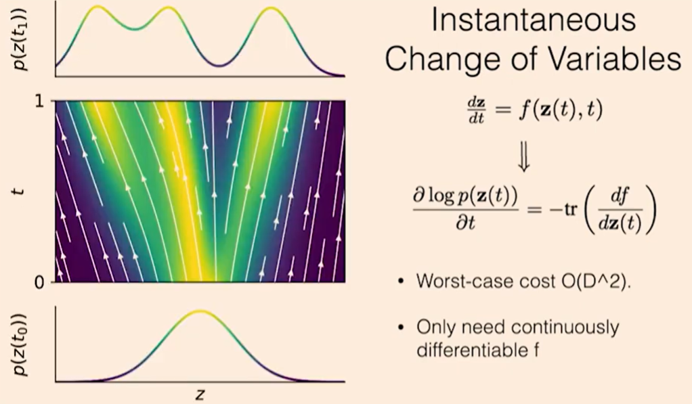
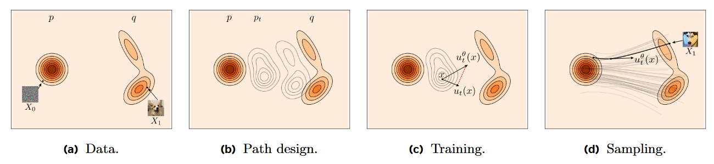
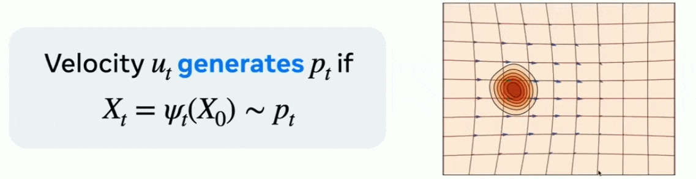
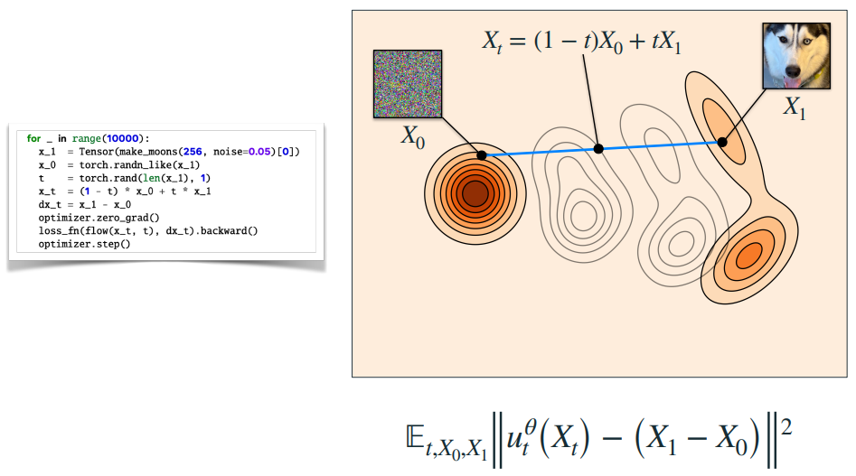
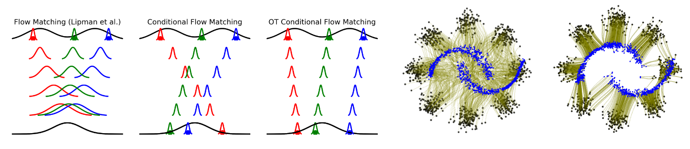

# flow matching timeline and key papers

Flow Matching 模型可以被视为扩散建模框架中的一种 $v$-预测。与纯噪声不同， $v$ 是数据与噪声的组合。

## 2018 arXiv(NeurIPS 2018 Oral): “Neural Ordinary Differential Equations” (Chen et al.)
> [Paper](https://neurips.cc/virtual/2018/oral/12596) & [Video](https://www.youtube.com/watch?v=V6nGT0Gakyg)

**Neural ODE 的核心思想**：把深度网络的层看成是时间上连续演化的状态，从而用微分方程来建模，而不是离散的层堆叠。

注意到残差网络与欧拉积分器之间有着密切的联系，只需做一个简单的改动，就能使其动力学像 ODE 一样随深度连续变化，
- 残差网络需要定义 ResNet 模块，它定义了每一层隐藏单元的更新，然后构建 ResNet，只需在每一层计算更新，并将其加入当前的隐藏状态，这看起来就像欧拉积分。
- 可以简单地将当前深度输入到 ResNet 模块，并对整个深度使用固定的参数集，这意味着在层之间也定义了动力学，并且可以随深度连续变化。因此这个模型实际上定义了一个常微分方程，可以自由地用更复杂的自适应求解器来替代欧拉方法，并且该求解器可以在任意位置评估动力网络，希望以尽可能少的步骤得到最终答案，可以看到中心的简单动力学比两侧更复杂的动力学需要更少的评估次数。

现在有了新的微分模型组件，可以随意放入模型中，将一组 ResNet 层全部替换为单个 ODE 网络，此外，ODENet 的优势在于它们通常比 ResNet 需要更少的参数，网络动态随深度平滑变化，相邻层的参数会自动绑定在一起，不同“层”（即不同时间点）共享同一组参数。

密度随时间如何变化？论文证明了相对于时间或深度的对数密度的导数是由雅可比矩阵的迹给出，将其称为瞬时变量变换定理，首先迹比行列式要更廉价，其次该公式不需要神经网络是可逆的，作者使用该定理构建了一种连续的新型生成密度模型——连续归一化流（Continuous Normalizing Flows, CNF），它们持续地将简单分布转换为复杂分布。

## 2022 arXiv(NeurIPS 2024 Tutorial): “Flow Matching for Generative Modeling” (Lipman et al.)
> [Paper](https://arxiv.org/abs/2210.02747) & [Openreview](https://openreview.net/forum?id=PqvMRDCJT9t) & [Video](https://neurips.cc/virtual/2024/tutorial/99531) & [Guide](https://arxiv.org/abs/2412.06264) & [Code](https://github.com/facebookresearch/flow_matching)

基于无需模拟（simulation-free）的连续归一化流训练，通过回归固定概率路径的速度场实现高效生成。引入 Optimal Transport 插值路径，加速训练和采样。

流匹配 Flow Matching，这是一种基于固定条件概率路径的回归向量场来训练 CNF 的免模拟方法。希望训练一个速度场 $u_t^\theta(x)$，该速度场生成一个从源开始的概率路径，使得在时刻 0 时 $p_0=p$，并且在结束时刻 1 时 $p_1=q$，其中 $p$ 是源分布， $q$ 是目标分布。

(a) 目标是找到将已知源或噪声分布 $q$ 的样本 $X_0$ 映射到未知目标或数据分布 $q$ 的样本 $X_1$ 的流。 (b) 为此，设计一条在 $p := p_0$ 和 $q := p_1$ 之间插值的时间连续概率路径 $(p_t)_{0≤t≤1}$。 (c) 在训练期间，使用回归来估计已知的速度场 $u_t$ 来生成 $p_t$。 (d) 为了绘制新的目标样本 $X_1 \sim q$，将估计的速度场 $u^\theta_t (X_t)$ 从 $t = 0$ 到 $t = 1$ 进行积分，其中 $X_0 \sim p$ 是新的源样本。

- **速度场** $u_t(x)$：就像每个时刻河流中不同位置的**水流**🌀**速度与方向**。它告诉你在时间 $t$ 时，一个在位置 $x$ 的落叶🍂该往哪边走、走多快。
- **流** $\psi_t(x)$ ：是指落叶🍂**从出发点开始，顺着速度场流动一段时间后，到达的位置**。也就是说，如果你从 $t=0$ 开始，让落叶🍂按速度场的指示漂流，到时间 $t$，落叶🍂的位置就是 $\psi_t(x)$。

微分是瞬时变化，积分是累积变化。要想知道时刻 $t$ 到达的位置 $\psi_t(x)$，就必须把所有时刻的变化累积起来，也就是求解这个常微分方程。

$$
\psi_t(x) = x + \int_0^t v_s(\psi_s(x)) \text ds.
$$

如果 $u_t(x)$ 定义的速度场在时刻 $t$ 将源分布 $p_0$ 重塑为 $p_t$，则说速度 $u_t(x)$ 生成了一个概率路径 $p_t$。

通过对单个目标样本 $X_1 = x_1$ 进行条件化，可以得到条件速度场，每个条件路径都以训练数据集中的一个样本 $X_1 = x_1$ 为条件，下面的路径也被称为条件最优传输路径，

$$
p_t(x) = \int p_{t|1}(x | x_1) \ q(x_1)\ \text dx_1,\quad \text{where} \ \  p_{t|1}(x | x_1) = \mathcal{N}(x | t x_1, (1 - t)^2 I).
$$

条件化后可以得到条件 Flow Matching 损失函数，最简版本的 Flow Matching 实现如下：

$$
\mathcal{L}^{\text{OT,Gauss}}_{\text{CFM}}(\theta)=
\mathbb{E}_{t, X_0, X_1}
\left\| u_t^\theta(X_t) - (X_1 - X_0) \right\|^2, \quad \text{where} \ \ t \sim \mathcal{U}[0, 1], \quad
X_0 \sim \mathcal{N}(0, I), \quad
X_1 \sim q.
$$

## 2023 arXiv(TMLR 2024): “Improving and generalizing flow-based generative models with minibatch optimal transport” (Tong et al.)
> [Paper](https://arxiv.org/abs/2302.00482) & [Openreview](https://openreview.net/forum?id=CD9Snc73AW) & [Video](https://www.youtube.com/watch?v=UhDtH7Ia9Ag) & [Code](https://github.com/atong01/conditional-flow-matching)

传统的 Flow Matching（FM）和 Conditional Flow Matching（CFM）提供了无需模拟（simulation-free）的回归式目标，但在 minibatch 情况下仍有高方差与训练不稳的问题。

**关键思想**：在 minibatch 层面上，用小批量间的最优传输（minibatch optimal transport, MIT/OT）来构建更直且低方差的条件映射，使得每个 batch 内的条件对（source→target）对齐更有结构性，从而显著降低训练目标的方差并使学到的流更接近全局 Optimal Transport（Wasserstein）解。论文把采用 OT 对齐的 CFM 称作 OT-CFM。

## 2024 arXiv(IEEE 2024): “Efficient Trajectory Forecasting and Generation with Conditional Flow Matching” (Ye et al.)
> [Paper](https://arxiv.org/abs/2403.10809) & [Code](https://github.com/CORE-Robotics-Lab/TCFM)

**强调实时决策**，提出轨迹条件 Flow Matching（T-CFM），学习时变向量场统一轨迹预测与生成任务。在对抗性跟踪、飞行轨迹预测等场景中，比扩散模型预测准确率高 35%，规划性能提升 142%；采样速度快 100 倍，支持实时决策。

## 2025 arXiv(ICML 2025 spotlight): “On the Guidance of Flow Matching” (Feng et al.)
> [Paper](https://arxiv.org/abs/2502.02150) & [Openreview](https://openreview.net/forum?id=pKaNgFzJBy) & [Video](https://icml.cc/virtual/2025/poster/44016) & [Code](https://github.com/AI4Science-WestlakeU/flow_guidance)

## 2025 arXiv(CoRL 2025): “Streaming Flow Policy: Simplifying diffusion/flow-matching policies by treating action trajectories as flow trajectories” (Jiang et al.)
> [Paper](https://arxiv.org/abs/2505.21851) & [Video](https://siddancha.github.io/streaming-flow-policy/) & [Code](https://github.com/CORE-Robotics-Lab/TCFM)

**强调在线流式输出**，针对动作序列生成，提出流式流动策略（Streaming Flow Policy）：从上一个动作附近的窄高斯分布采样，迭代积分学习到的速度场，生成一系列连续动作。

不同于常规扩散策略（需完整生成整个轨迹后才执行），该方法将流采样时间与动作执行时间对齐，可在流采样过程中实时串流输出动作，显著提高控制响应速度；同时保持多模态特征。

## 2025 arXiv(NeurIPS 2025): “Mean Flows for One-step Generative Modeling” (Geng et al.)
> [Paper](https://arxiv.org/abs/2505.13447) & [Code](https://github.com/haidog-yaqub/MeanFlow)

**最大的创新在于**：将传统流匹配（Flow Matching）中学习“瞬时速度”（instantaneous velocity field）改为学习“平均速度”（average velocity field）。“平均”这里指在一个时间区间上状态变化的平均速率，而不是状态在每个瞬间的速率。由于直接学习平均速度场，MeanFlow 能够支持真正意义上的“1-NFE” (Number of Function Evaluations = 1)，即从噪声直接生成样本，仅一次函数调用即可完成生成，这极大加速了推理过程。

## 2025 arXiv(ICLR 2026): “Safe Flow Matching: Robot Motion Planning with Control Barrier Functions” (Dai et al.)
> [Paper](https://arxiv.org/abs/2504.08661) & [Website](https://safeflowmatching.github.io/) & [Code](https://github.com/SafeFlowMatching/SafeFlow)

**强调实时安全约束**，在 FM 框架中嵌入流匹配型控制障碍函数，保证生成轨迹全程安全。无需重新训练，实时在测试阶段执行安全校正。兼顾流匹配生成多模态轨迹能力，与其他生成式规划方法相比，在多场景下提供了显著更强的安全性和规划性能。

## 2025 arXiv(CVPR 2026): “GoalFlow: Goal-Driven Flow Matching for Multimodal Trajectories Generation in End-to-End Autonomous Driving” (Xing et al.)
> [Paper](https://arxiv.org/abs/2503.05689) & [Website](https://zebinx.github.io/HomePage-of-GoalFlow/) & [Code](https://github.com/YvanYin/GoalFlow)

在多模态轨迹生成中引入目标点约束，通过评分机制选取最优目标；使用 Flow Matching 生成多模态轨迹，并根据场景信息优化评分选最佳轨迹。相比纯扩散方法需要多步迭代，GoalFlow 仅需 **一步（无迭代去噪）** 即可生成高质量轨迹。
