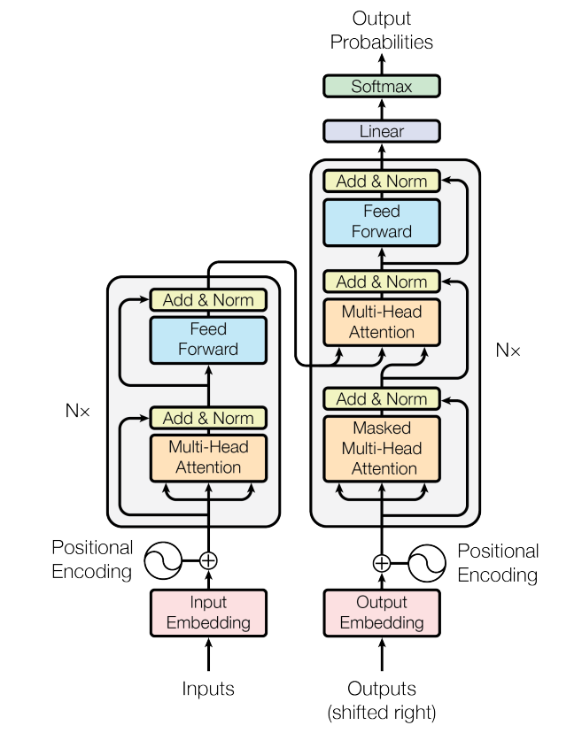
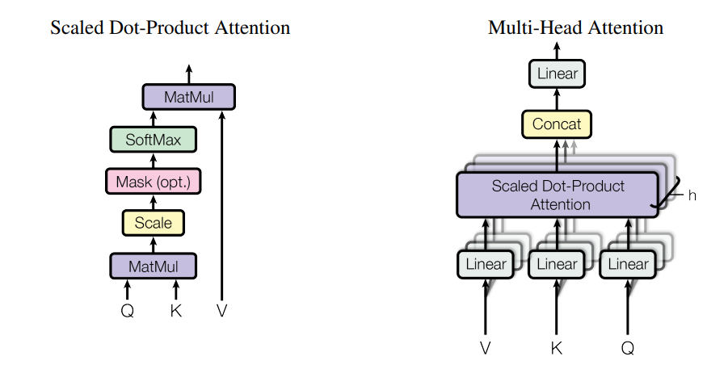

# Large Language models timeline and key papers
[Open Source LLM Development Landscape](https://antoss-landscape.my.canva.site/)

## Table of Contents
* [Introduction](#introduction)
* [1 Foundational Theory and Early Pioneering Works](#1-foundational-theory-and-early-pioneering-works)
  
* [2 Core Large Language models](#2-core-large-language-models)
  * [2017 — Vaswani et al. (Attention is all you need)](#2017—vaswani-et-al-attention-is-all-you-need)
  * [2020 — Lewis et al. (RAG)](#2020—lewis-et-al-RAG)
  * [2022 — Hu et al. (LoRA)](#2022—Hu-et-al-LoRA)
  * [2022 — Brown et al. (GPT-3)](#GPT-3-brown-et-al)
---
  

# Introduction
大语言模型

---

# 1. Foundational Theory and Early Pioneering Works

# 2. Core Large Language models

## **2017 arXiv(NeurIPS 2020): “Attention Is All You Need” (Vaswani et al.)**

> [Paper](https://arxiv.org/abs/1706.03762) & [Openreview](https://proceedings.neurips.cc/paper_files/paper/2017/file/3f5ee243547dee91fbd053c1c4a845aa-Reviews.html) & [Code(Original Tensorflow version)](https://github.com/tensorflow/tensor2tensor/blob/master/tensor2tensor/models/transformer.py) & [Code(Pytorch version)](https://github.com/jadore801120/attention-is-all-you-need-pytorch) & [Video(3Blue1Brown: Transformers, the tech behind LLMs)](https://www.youtube.com/watch?v=wjZofJX0v4M) & [Video(3Blue1Brown: Attention in transformers)](https://www.youtube.com/watch?v=eMlx5fFNoYc)

提出了一种新的模型架构 Transformer，它放弃了循环结构，完全依赖注意力机制来建立输入和输出之间的全局依赖关系，从而允许显著的 **并行化**。它采用 **编码器-解码器结构**，编码器将符号表示的输入序列 $(x_1, ..., x_n)$ 映射为连续表示序列 $z = (z_1, ..., z_n)$，给定 $z$ 后，解码器逐个生成符号的输出序列 $(y_1, ..., y_m)$，在每一步，模型是自回归的，生成下一个符号时，消耗之前生成的符号作为附加输入。

使用 **缩放点积注意力**，计算查询与所有键的点积，将每个点积除以 $\sqrt{d_k}$，然后应用 softmax 函数得到对值的权重，输出矩阵为：

$$
\text{Attention}(Q, K, V) = \text{softmax}\left( \frac{QK^T}{\sqrt{d_k}} \right)V
$$

## **2020 arXiv(NeurIPS 2020): “Retrieval-Augmented Generation for Knowledge-Intensive NLP Tasks” (Lewis et al.)** (RAG)

> [Paper](https://arxiv.org/abs/2005.11401) & [Video](https://www.youtube.com/watch?v=JGpmQvlYRdU) & [Blog](https://ai.meta.com/blog/retrieval-augmented-generation-streamlining-the-creation-of-intelligent-natural-language-processing-models/)
  
大型语言模型（LLM）的参数本质上表示人类用词组成句子的总体模式。参数化的知识使得 LLM 在回应一般性提示时很有用；然而，对于想要深入某一特定类型信息的用户来说，这并不足够。检索增强生成（RAG）能够将生成式 AI 服务与外部资源（尤其是那些富含最新技术细节的资源）连接起来。它是一种“通用的微调方案”，因为几乎任何 LLM 都可以使用它来对接几乎任何外部资源。

例如，给定提示“第一只哺乳动物何时出现在地球上？”，RAG 可能会检索关于“哺乳动物”、“地球史”和“哺乳动物的进化”等主题的文档。这些支持性文档随后与原始输入串联作为上下文，一并输入到生成实际输出的序列到序列（seq2seq）模型中。因此，RAG 有两类知识来源：一类是 seq2seq 模型 **存储在其参数中的知识**（参数化记忆），另一类是 **存储在 RAG 所检索语料库中的知识**（非参数化记忆）。

> [Here](https://developer.nvidia.com/blog/rag-101-demystifying-retrieval-augmented-generation-pipelines/) is a overview of RAG pipeline components: ingest and query flows.

  
RAG 为模型提供了可供引用的来源，就像学术论文中的脚注，用户可以据此核查任何断言。它还能降低模型给出看似很有道理但实际上不正确答案的可能性——这种现象称为“幻觉”。

## **2021 arXiv(ICLR 2022): “LoRA: Low-Rank Adaptation of Large Language Models” (J. Hu et al.)**

> [Paper](https://arxiv.org/abs/2106.09685) & [OpenReview](https://openreview.net/forum?id=nZeVKeeFYf9) & [Video](https://www.youtube.com/watch?v=DhRoTONcyZE) & [Code](https://github.com/microsoft/LoRA)

## **2022 arXiv (NeurIPS 2020): “Language Models are Few-Shot Learners” (Brown et al.)** (GPT-3)

> [Paper](https://arxiv.org/abs/2005.14165)
