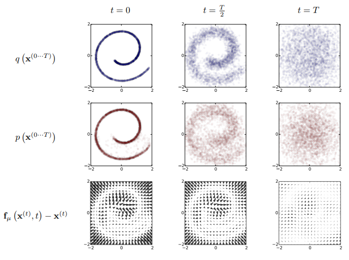
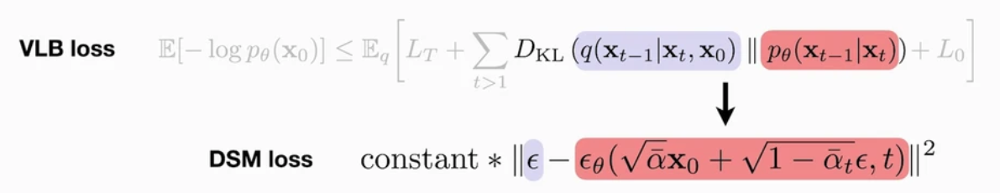
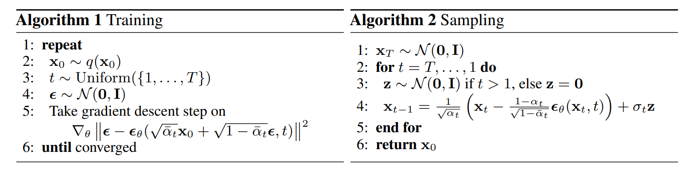
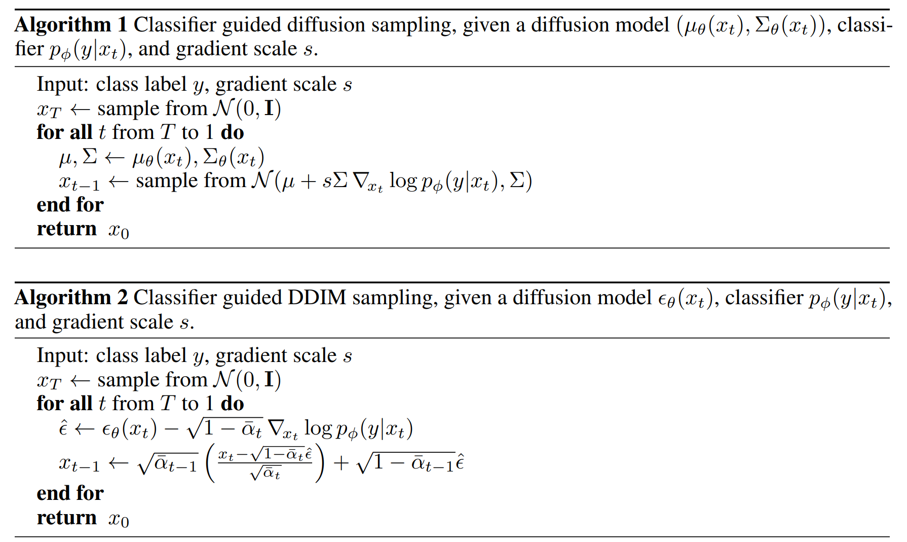
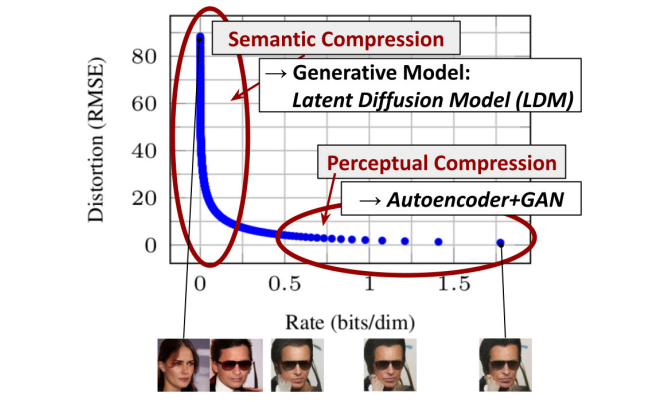

# Diffusion Model Timeline and Key Papers

## Table of Contents

* [Introduction](#introduction)
* [1 Foundational Theory and Early Pioneering Works (2015–2019)](#1-foundational-theory-and-early-pioneering-works-2015–2019)

  * [2015 — Sohl-Dickstein et al. (Deep Unsupervised Learning using Nonequilibrium Thermodynamics)](#2015—sohl-dickstein-et-al-deep-unsupervised-learning-using-nonequilibrium-thermodynamics)
  * [2019 — Y. Song & E. Ermon (Score-based generative modeling / NCSN)](#2019—y-song--e-ermon-score-based-generative-modeling--ncsn)
* [2 Core Diffusion Models (2020–2021)](#2-core-diffusion-models-2020–2021)

  * [2020 — Ho et al. (DDPM)](#2020—ho-et-al-denoising-diffusion-probabilistic-models)
  * [2020 — Song et al. (Score-Based Generative Modeling through SDEs)](#2020—song-et-al-score-based-generative-modeling-through-sdes)
  * [2020 — Song et al. (DDIM)](#2020—song-et-al-denoising-diffusion-implicit-models)
  * [2021 — Nichol & Dhariwal (Improved DDPM)](#2021—nichol--dhariwal-improved-denoising-diffusion-probabilistic-models)
  * [2021 — Dhariwal & Nichol (Diffusion Models Beat GANs)](#2021—dhariwal--nichol-diffusion-models-beat-gans-on-image-synthesis)
  * [2021 — Ho et al. (Classifier-Free Guidance)](#2021—ho-et-al-classifier-free-diffusion-guidance)
* [3 Specific Applications of Diffusion Models](#3-specific-applications-of-diffusion-models)

  * [3.1 Image Generation from Text Descriptions](#31-image-generation-from-text-descriptions)

    * [Stable Diffusion (Rombach et al.)](#stable-diffusion-rombachetal)
    * [DALL·E 2 (Ramesh et al.)](#dall·e-2-ramesh-et-al)
    * [Imagen (Saharia et al.)](#imagen-saharia-et-al)
  * [3.2 Language Generation](#32-language-generation)
  * [3.3 Physical Control Systems & Planning](#33-physical-control-systems--planning)

    * [CSDI (Tashiro et al.)](#csdi-tashiro-et-al)
    * [Decision Diffuser / Ajay et al.](#decision-diffuser-ajay-et-al)
    * [Diffuser (Janner et al.)](#diffuser-janner-et-al)
    * [Loss-Guided Diffusion (ICML 2023)](#loss-guided-diffusion-icml-2023)
    * [Diffusion Policy (Chi et al.)](#diffusion-policy-chi-et-al)
    * [TSGM (Nikitin et al.)](#tsgm-nikitin-et-al)
    * [DiffPhyCon (Wei et al.)](#diffphycon-wei-et-al)
    * [CL-DiffPhyCon (Wei et al.)](#cl-diffphycon-wei-et-al)
    * [DPPO (Ren et al.)](#dppo-ren-et-al)
    * [Diffuse-CLoC (Huang et al.)](#diffuse-cloc-huang-et-al)
* [Appendix](#Appendix)
  * [Unet](#unet)

---
  

## Introduction

扩散模型是一类强大的生成式框架，它们通过学习噪声注入过程的逆过程来从复杂的数据分布中采样。这使得它们在需要分布匹配的任务上表现得尤为出色——例如文本生成、图像合成、音频/音乐生成、视频生成与预测、分子设计与药物发现、逆问题与重建、数据增强与去噪等。

---

## 1. Foundational Theory and Early Pioneering Works (2015–2019)

* **2015 arXiv (ICML 2015): “Deep Unsupervised Learning using Nonequilibrium Thermodynamics” (Sohl-Dickstein et al.)**

  > [Paper](https://arxiv.org/abs/1503.03585) & [Video](https://www.youtube.com/watch?v=XLzhbXeK-Os) & [Code](https://github.com/Sohl-Dickstein/Diffusion-Probabilistic-Models/tree/master)

  作者首先提出了一个扩散模型框架。受非平衡统计物理的启发，他们定义了一个前向扩散过程，将任意复杂的数据分布转换为一个简单且解析可处理的分布（例如零均值、单位协方差的高斯分布），然后训练一个神经网络去学习该扩散过程在有限时间内的逆过程，该逆过程定义了生成模型的分布。

  

  **证据下界（ELBO）的推导**：将似然最大化转换为对数似然最大化 $\mathcal L=\mathbb{E}\_{q(x^{(0)})}\[\log p(x^{(0)})]$，以便利用詹森不等式将 $\log\int$ 转换为可计算的 $\int\log$ 的下界，然后将该下界按时间步分解，使得每一项都成为一个 KL 散度。

  **优化目标与训练**：通过将每个逆向扩散核视为一个参数化模型，核心训练目标就变为寻找每一步逆向核的均值和协方差函数的最优参数，以最大化该对数似然下界。这等价于同时最小化每一步逆向核与真实后验之间的 KL 散度。这样，估计一个复杂分布的问题就简化为预测每个逆向扩散步骤所需的参数。

  > 把生成问题转化为对前向扩散逆过程的学习，相比直接建模数据分布有如下优势：训练稳定性、明确化的训练目标（ELBO）、可控采样过程、与物理直觉的联系。

* **2019 arXiv (NeurIPS 2019): “Generative Modeling by Estimating Gradients of the Data Distribution” (Y. Song & E. Ermon)**

  > [Paper](https://arxiv.org/abs/1907.05600) & [Blog](http://yang-song.net/blog/2021/score/) & [Video](https://www.youtube.com/watch?v=8TcNXi3A5DI) & [Code](https://github.com/ermongroup/ncsn) & [Summary Video](https://www.youtube.com/watch?v=wMmqCMwuM2Q)

  作者提出了一种基于 score 的生成建模框架。在该框架中，他们首先通过 score matching 来估计数据对数密度的梯度 $\nabla\_x \log p\_{\rm data}(x)$，然后在采样阶段利用 Langevin 动力学：在每次迭代中沿着所学得的 score 方向迈出小步，同时注入噪声。通过这种方式，随机噪声会在学习到的对数密度景观上逐步“爬升”到高概率区域，从而生成逼真的新样本。

  

  **关于 score 函数的说明**：与统计学中常见的 score 函数不同，score matching 中的 score 是对输入 $x$ 的梯度，而不是对模型参数 $\theta$ 的梯度。在这里，score 函数是一个向量场，指示了密度函数增长最快的方向。

  **基于 score 的建模框架的核心思想**：Langevin 动力学仅依赖于 score 函数 $\nabla\_{\mathbb x} \log p(\mathbb x)$，即可从某个概率密度 $p(\mathbb x)$ 中生成样本。为了从数据分布 $p\_\text{data}(\mathbb x)$中获得样本，需要首先训练一个 score 网络，使得 $\mathbb s\_\theta(\mathbb x) \approx \nabla\_x \log p\_\text{data}(\mathbb x)$，然后使用 $\mathbb s\_\theta(\mathbb x)$ 在 Langevin 动力学中近似采样。

  

  **改进的基于 score 的生成建模**：研究者观察到，用高斯噪声扰动数据会让分布更适合基于 score 的生成建模。因此，他们在多个噪声水平上对数据进行破坏，然后训练一个噪声条件 score 网络（NCSN），即
$s\_\theta(x,\sigma)\approx\nabla\_x\log q\_\sigma(x)$ 以同时估计所有噪声尺度下的 score。该网络采用了 U-Net 架构，结合了 空洞卷积（dilated convolution），并使用 instance normalization。在训练好 NCSN $s\_\theta(x,\sigma)$ 后，作者受到模拟退火与退火重要性采样的启发，提出了一种新的采样过程——退火 Langevin 动力学。直观上，他们希望逐步降低数据分布的“温度”，以逐渐减小噪声水平。

---

## 2. Core Diffusion Models (2020–2021)

* **2020 arXiv (NeurIPS 2020): “Denoising Diffusion Probabilistic Models” (Ho et al.)**

  > [Paper](https://arxiv.org/abs/2006.11239) & [Website](https://hojonathanho.github.io/diffusion/) & [Video](https://slideslive.com/38936172) & [Code (official Tensorflow version)](https://github.com/hojonathanho/diffusion) & [Code (Pytorch version)](https://github.com/lucidrains/denoising-diffusion-pytorch) & [An In-Depth Guide Blog](https://learnopencv.com/denoising-diffusion-probabilistic-models/)

  

  The authors theoretically prove that the variational inference objective (maximizing log-likelihood) and the mean-squared-error training for noise prediction are mathematically equivalent, unifying the two viewpoints. From the variational inference perspective, DDPM decomposes the log-likelihood lower bound (VLB) into a series of KL divergences. From the score-matching perspective, the network implicitly performs score matching on each noisy data distribution by predicting the added noise. Optimizing the VLB naturally yields a weighted noise-prediction (score-matching) objective, and conversely, directly training to predict noise also maximizes the data log-likelihood.

  

  The training loss evolves from variational inference to denoising score matching, and Langevin dynamics is the natural sampler for denoising score matching.

  

* **2020 arXiv (ICLR 2021): “Score-Based Generative Modeling through SDEs” (Song et al.)**

  > [Paper](https://arxiv.org/pdf/2011.13456) & [OpenReview](https://openreview.net/forum?id=PxTIG12RRHS) & [Video](https://iclr.cc/virtual/2021/poster/3177) & [Blog](http://yang-song.net/blog/2021/score/) & [Code (Tensorflow version)](https://github.com/yang-song/score_sde) & [Code (Pytorch version)](https://github.com/yang-song/score_sde_pytorch)

  By elevating the traditional discrete noise-perturbation process to a continuous-time stochastic differential equation (SDE) perspective, this work unifies various score-based generative models (such as SMLD and DDPM) under a single framework. Specifically, transforming data to a simple noise distribution can be accomplished with a continuous-time SDE and—according to Anderson’s 1982 result— this SDE can be reversed if we know the score of the distribution at each intermediate time step, \$\nabla\_x \log p\_t(x)\$. To train the score network \$s\_\theta(x, t)\approx \nabla\_x \log p\_t(x)\$, the authors propose a unified, SDE-based objective using weighted denoising score matching (DSM).

  

  By designing different functions \$f(t)\$ and \$g(t)\$, various known models can be realized: When \$f = 0\$, \$g(t) = \sqrt{2\beta(t)}\$, it corresponds to the Variance Preserving (VP) SDE, which is equivalent to DDPM. When \$f = -\frac{1}{2}\beta(t)\mathbf{x}\$, \$g(t) = \sqrt{\beta(t)}\$, it corresponds to the Variance Exploding (VE) SDE, matching the original score-based models (e.g., NCSN). New diffusion paths can also be defined, such as sub-VP.

  

  They show it is possible to convert any SDE into an ordinary differential equation (ODE) without changing its marginal distributions. Thus by solving this ODE, they can sample from the same distributions as the reverse SDE. The corresponding ODE of an SDE is named probability flow ODE.

  The authors unify various sampling methods under the SDE framework: the reverse SDE can be solved using general-purpose SDE solvers such as Euler–Maruyama or stochastic Runge-Kutta. They propose the Predictor–Corrector (PC) sampler, which combines ancestral sampling (e.g., from DDPM) as the predictor step and Langevin MCMC (e.g., from SMLD) as the corrector step to refine the sample at each step. Additionally, they introduce the Probability Flow ODE sampler, a deterministic generative process that enables exact likelihood computation and controllable, path-consistent generation.

  Finally, the paper presents a method for conditional generation by incorporating the gradient of a classifier \$\nabla\_{\mathbf{x}} \log p\_\phi(y|\mathbf{x})\$ into the reverse SDE or ODE, enabling classifier guidance to steer the generation toward desired classes.

* **2020 arXiv (ICLR 2021): “Denoising Diffusion Implicit Models” (Song et al.)**

  > [Paper](https://arxiv.org/abs/2010.02502) & [OpenReview](https://openreview.net/forum?id=St1giarCHLP) & [Video](https://slideslive.com/38953675) & [Code](https://github.com/ermongroup/ddim)

  The authors devise a family of “skip-step” noise-injection processes, parameterized by σ, that inject the same amount of noise at each key timestep as a DDPM but no longer require strictly Markovian, one-step-at-a-time progression through every intermediate step.

  

  They further show that no matter which σ-parameterized “skip-step” noise-injection process you choose, the variational lower-bound objective you minimize during training is exactly the same \$L\_1\$ surrogate loss used in DDPMs. In other words, you only need to train the model once with the standard procedure, and you can then freely switch between different noise-injection/denoising trajectories at sampling time without retraining.

  ![Figure 8. Graphical model for accelerated generation, where \$\tau=\[1, 3\]\$.](./assets/figure8.png)

  This allows you to perform both the forward noise injection and reverse denoising only on a chosen subsequence \${\tau\_1,\dots,\tau\_S}\$, so that when \$S\ll T\$, you achieve a 10×–100× speedup while maintaining high sample quality, with no retraining required.

* **2021 arXiv (ICML 2021): “Improved Denoising Diffusion Probabilistic Models” (Nichol & Dhariwal)**

  > [Paper](https://arxiv.org/abs/2102.09672) & [OpenReview](https://openreview.net/forum?id=-NEXDKk8gZ) & [Code](https://github.com/openai/improved-diffusion)

  This paper presents a series of improvements to DDPM models aimed at improving the log-likelihood.

  **Learning Variance**: It first identifies that although the variance is less critical than the mean for sample quality, the initial steps of the diffusion process contribute most significantly to the variational lower bound (VLB). To improve log-likelihood, the authors parameterize the variance as an interpolation between the theoretically optimal reverse variance \$\tilde \beta\_t\$ and the forward process variance \$\beta\_t\$ in the log domain. A hybrid objective \$L\_\text{hybrid}\$ is introduced to jointly optimize the simplified DDPM objective \$L\_\text{simple}\$ (for noise prediction) and the VLB \$L\_\text{vlb}\$ (for likelihood optimization). In this setup, \$L\_\text{simple}\$ serves as the primary signal for updating the mean network \$\mu\_\theta\$, while stop-gradient applied to \$\mu\_\theta\$ ensures that \$L\_\text{vlb}\$ only guides the updates of the variance network \$\Sigma\_\theta\$.

  

  **Improving the Noise Schedule**: The authors propose a cosine noise schedule, which uses a squared cosine function to control the cumulative noise level \$\bar \alpha\_t\$, ensuring gradual changes at the beginning and end of the diffusion process to avoid abrupt noise increases or premature information destruction, while allowing faster changes in the middle phase.

  

  **Reducing Gradient Noise**: The authors confirm that greatly different magnitudes among different terms of L\_vlb are the source of noise. To address this, they employ an importance sampling strategy, dynamically adjusting the sampling probability based on the historical mean squared values of each loss term, thereby significantly reducing gradient noise. This method makes direct optimization of L\_vlb feasible, achieving superior log-likelihood performance compared to the hybrid objective L\_hybrid, with a smoother training process.

* **2021 arXiv (NeurIPS 2021): “Diffusion Models Beat GANs on Image Synthesis” (Dhariwal & Nichol)**

  > [Paper](https://arxiv.org/abs/2105.05233) & [OpenReview](https://openreview.net/forum?id=AAWuCvzaVt) & [Video](https://slideslive.com/38967263) & [Code](https://github.com/openai/guided-diffusion)

  The authors show that diffusion models beat GANs on unconditional image synthesis by finding a better architecture through a series of ablations. The improvements are primarily focused on building on the DDPM’s U-Net architecture by increasing the model’s depth and width, adding more attention heads, and employing attention mechanisms at multiple resolutions.

  For conditional image synthesis, they further improve sample quality with classifier guidance. The idea here is that if you have class labels together with your dataset, you can train a classifier \$p\_\phi(y|x\_t, t)\$ on not only the dataset but also noisy samples of the dataset, and then you can use the gradients from this classifier \$\nabla\_{x\_t}\log p\_\phi(y|x\_t, t)\$ in order to guide the generation during the reverse diffusion sampling process, enabling it to produce images of the specified class.

  

  Specifically, at each denoising sampling step, one only needs to add an offset term \$\Sigma g\$—determined by the classifier gradient \$g\$ and the model variance \$\Sigma\$—to the mean \$\mu\$ predicted by the unconditional model, thereby guiding the generation process towards the desired class.

  

* **2021 arXiv (NeurIPS 2021): “Classifier-Free Diffusion Guidance” (Ho et al.)**

  > [Paper](https://arxiv.org/abs/2207.12598) & [OpenReview](https://openreview.net/forum?id=qw8AKxfYbI) & [Code](https://github.com/lucidrains/classifier-free-guidance-pytorch) & [Blog](https://sander.ai/2022/05/26/guidance.html)

  The classifier must be trained on the noisy data so it is generally not possible to plug in a pre-trained classifier. Rather than sampling in the direction of the gradient of an image classifier, classifier-free guidance instead mixes the score estimates of a conditional diffusion model and a jointly trained unconditional diffusion model. The authors use a single network to parameterize both models, where for the unconditional model they can simply input a null token \$\varnothing\$ for the class identifier \$\mathbb c\$ when predicting the score. They jointly train the unconditional and conditional models simply by randomly setting \$\mathbb c\$ to the unconditional class identifier \$\varnothing\$ with some probability \$p\_\text{uncond}\$, set as a hyperparameter.

  

  They then perform sampling using the linear combination of the conditional and unconditional score estimates.

  

---

## 3. Specific Applications of Diffusion Models

### 3.1 Image Generation from Text Descriptions

* **2021 arXiv (CVPR 2022): “High-Resolution Image Synthesis with Latent Diffusion Models” (Rombach et al.)** (Stable Diffusion)

  > [Paper](https://arxiv.org/abs/2112.10752) & [Video](https://www.youtube.com/watch?v=-3EkERbcZns) & [Video](https://www.youtube.com/watch?v=7W4aZObNucI) & [Code](https://github.com/CompVis/latent-diffusion)

  Diffusion models belong to the class of likelihood-based models, whose mode-covering behavior makes them prone to spend excessive amounts of capacity (and thus compute resources)
  on modeling imperceptible details of the data. To reduce the computational complexity for both training and sampling, the authors introduce an explicit separation of the compressive from the generative learning phase.

  

  To achieve this, they utilize an autoencoding model which learns a space that is perceptually equivalent to the image space, but offers significantly reduced computational complexity. Conditional distributions of the form \$p(z|y)\$ can be implemented with a conditional denoising autoencoder \$\epsilon\_\theta(z\_t, t, y)\$. A more flexible way is by augmenting the underlying UNet backbone with cross-attention mechanism, which is effective for learning attention-based models of various input modalities.

  

* **2022 arXiv: “Hierarchical Text-Conditional Image Generation with CLIP Latents” (Ramesh et al.)** (DALL·E 2)

  > [Paper](https://arxiv.org/abs/2204.06125) & [Website](https://openai.com/index/dall-e-2/) & [Video](https://www.youtube.com/watch?v=TvBjoN3zkPY) & [Code](https://github.com/lucidrains/DALLE2-pytorch)

* **2022 arXiv (NeurIPS 2022 Outstanding Paper Award): “Photorealistic Text-to-Image Diffusion Models with Deep Language Understanding” (Saharia et al.)** (Imagen)

  > [Paper](https://arxiv.org/abs/2205.11487) & [OpenReview](https://openreview.net/forum?id=08Yk-n5l2Al) & [Website](https://imagen.research.google/)

---

### 3.2 Language Generation

* **2022 arXiv (NeurIPS 2020): “Language Models are Few-Shot Learners” (Brown et al.)** (GPT-3)

  > [Paper](https://arxiv.org/abs/2005.14165)

---

### 3.3 Physical Control Systems & Planning

* **2021 arXiv (NeurIPS 2021): “CSDI: Conditional Score-based Diffusion Models for Probabilistic Time Series Imputation” (Tashiro et al.)**

  > [Paper](https://arxiv.org/abs/2107.03502) & [OpenReview](https://openreview.net/forum?id=VzuIzbRDrum) & [Code](https://github.com/ermongroup/CSDI)

* **2022 arXiv (ICLR 2023): “Is Conditional Generative Modeling all you need for Decision-Making?” (Ajay et al.)**

  > [Paper](https://arxiv.org/abs/2211.15657) & [Video](https://iclr.cc/virtual/2023/oral/12696) & [Website](https://anuragajay.github.io/decision-diffuser/) & [Code](https://github.com/anuragajay/decision-diffuser)

  The key contribution lies in demonstrating that conditional diffusion policies can surpass traditional offline RL methods without relying on dynamic programming, while also supporting multiple constraints and skill composition.

  The authors demonstrate that, when action trajectories are non-smooth, the design of diffusing only the state sequence and then predicting actions via an inverse dynamics model outperforms jointly diffusing both states and actions. Specifically, this approach first diffuses the state sequence to generate an optimal state trajectory. Subsequently, for any two consecutive states \$s\_t\$ and \$s\_{t+1}\$ within the trajectory, it estimates the action required to achieve this state transition using an inverse dynamics model. This "plan the path first, then derive the actions" paradigm represents a key innovation that distinguishes methods like Decision Diffuser from traditional reinforcement learning and direct action generation approaches.

  

  They directly train a diffusion model conditioned on the trajectory return \$y(\tau)\$ from the offline dataset, using classifier-free guidance combined with low-temperature sampling to extract high-likelihood trajectories. Specifically, they condition the noise model on the trajectory return—first normalizing \$R(\tau)\$ to lie in $\[0,1]\$, then sampling with the condition \$R(\tau)=1\$ to obtain high-return trajectories. To generate trajectories that satisfy a given constraint \$C\_i\$ or demonstrate a particular skill, they condition the noise model on a one-hot encoding of that constraint or skill.

* **2022 arXiv (ICML 2022): “Planning with Diffusion for Flexible Behavior Synthesis” (Janner et al.)**

  > [Paper](https://arxiv.org/abs/2205.09991) & [Video](https://icml.cc/virtual/2022/oral/18292) or [Video (YouTube)](https://www.youtube.com/watch?v=ViBkYHg4rPI) & [Code](https://github.com/jannerm/diffuser) & [Website](https://diffusion-planning.github.io/)

  The core contribution of this work is a denoising diffusion model and its probabilistic framework for behavior generation, Diffuser, specifically designed for trajectory data, capable of predicting all time steps of the entire plan simultaneously.

* **ICML 2023: “Loss-Guided Diffusion Models for Plug-and-Play Controllable Generation” (Song et al.)**

  > [Paper](https://icml.cc/virtual/2023/poster/24571)

  As long as we can compute the loss \$\ell\_y(\hat{x}*t)\$ and its gradient \$\nabla*{\hat{x}\_t}\ell\_y\$ on the predicted denoised sample \$\hat{x}\_t\$ at each step, we can provide a guidance direction for the current sampling state \$x\_t\$ at any time \$t\$.

  The diffusion model’s denoising process gradually removes noise from \$x\_T\$ toward \$x\_0\$. At each step, given the current \$x\_t\$, the diffusion model can predict the corresponding “clean” sample \$\hat{x}\_t \approx \mathbb{E}\[x\_0 \mid x\_t]\$, which is the MMSE point estimate. Once we have \$\hat{x}\_t\$, we can:

  * **Compute \$\ell\_y(\hat{x}\_t)\$:** measure how well it matches the condition \$y\$;
  * **Compute the gradient \$\nabla\_{\hat{x}\_t}\ell\_y\$:** indicate how to move \$\hat{x}\_t\$ to better satisfy the condition;
  * **Backpropagate this gradient to \$x\_t\$:** steer the diffusion model’s sampling direction.

  So where does the guidance direction come from? In practice we compute \$\nabla\_{x\_t}\ell\_y(\hat{x}\_t(x\_t)) = \frac{\partial \hat{x}*t}{\partial x\_t}^\top ,\nabla*{\hat{x}\_t}\ell\_y\$, where \$\frac{\partial \hat{x}\_t}{\partial x\_t}\$ is the Jacobian (the gradient pathway) obtained by backpropagating through the diffusion model’s prediction network. In this way, the loss defined on \$\hat{x}\_t\$ is “pulled back” to the current state \$x\_t\$, causing the sampling trajectory to progressively move toward the desired condition.

* **2023 arXiv (IJRR 2024): “Diffusion Policy: Visuomotor Policy Learning via Action Diffusion” (Chi et al.)**

  > [Paper](https://arxiv.org/abs/2303.04137) & [Video](https://www.youtube.com/watch?v=M03sZFfW-qU) & [Code](https://github.com/real-stanford/diffusion_policy) & [Website](https://diffusion-policy.cs.columbia.edu/)

  The authors introduce a new form of robot visuomotor policy that generates behavior via a “conditional denoising diffusion process on robot action space”, called Diffusion Policy. Instead of directly outputting an action, the policy infers the action-score gradient, conditioned on visual observations, for K denoising iterations.

  

  

* **2023 arXiv (NeurIPS 2024): “TSGM: A Flexible Framework for Generative Modeling of Synthetic Time Series” (Nikitin et al.)**

  > [Paper](https://arxiv.org/abs/2305.11567) & [Video](https://neurips.cc/virtual/2024/poster/97532) & [Code](https://github.com/AlexanderVNikitin/tsgm) & [Website](https://tsgm.readthedocs.io/en/latest/)

  This is a work to study the time series generation problem based on the diffusion method. The TSGM architecture includes three components: an encoder, a decoder and a conditional score-matching network. The pre-trained encoder is used to embed the underlying time series into a latent space. The conditional score-matching network is used to sample the hidden states, which are then converted to the time series samples via the decoder.

* **2024 arXiv (NeurIPS 2024): “DiffPhyCon: A Generative Approach to Control Complex Physical Systems” (Wei et al.)**

  > [Paper](https://web3.arxiv.org/abs/2407.06494) & [Video](https://neurips.cc/virtual/2024/poster/95505) & [Code](https://github.com/AI4Science-WestlakeU/diffphycon) & [Website](https://ai4s.lab.westlake.edu.cn/publications/2024/10/04/DiffPhyCon-A-Generative-Approach-to-Control-Complex-Physical-Systems.html)

* **2024 arXiv (ICLR 2025): “CL-DiffPhyCon: Closed-loop Diffusion Control of Complex Physical Systems” (Wei et al.)**

  > [Paper](https://arxiv.org/abs/2408.03124) & [Video](https://iclr.cc/virtual/2025/poster/29738) & [Code](https://github.com/AI4Science-WestlakeU/CL_DiffPhyCon) & [Website](https://ai4s.lab.westlake.edu.cn/publications/2025/01/24/Closed-loop-Diffusion-Control-of-Complex-Physical-Systems.html)

* **2024 arXiv (ICLR 2025): “Diffusion Policy Policy Optimization” (Ren et al.)**

  > [Paper](https://arxiv.org/abs/2409.00588) & [Video](https://iclr.cc/virtual/2025/poster/28475) & [Code](https://github.com/irom-princeton/dppo) & [Website](https://diffusion-ppo.github.io/)

* **2025 arXiv (ICLR 2025): “Diffuse-CLoC: Guided Diffusion for Physics-based Character Look-ahead Control” (Huang et al.)**

  > [Paper](https://arxiv.org/abs/2503.11801) & [Video]() & [Code](https://www.youtube.com/watch?v=iTYs83WtGB4) & [Website](https://diffusecloc.github.io/website/)

  

  **The same pre-trained diffusion model with different guidance techniques**: During training, they randomly sample time steps for state and action denoising independently, ensuring varied noise levels across trajectories. The model learns to denoise by predicting clean trajectories through mean squared error loss minimization. Next, during inference time conditioning, they use classifier guidance to complete novel downstream tasks. For each diffusion step, they input the noisy trajectory at step K into the model to predict both the clean trajectory and the noise. Then compute task specific costs and gradients based on predicted states and environmental information. These gradients modify the predicted noise to determine the next denoising steps mean from which they sample the next noisy trajectory iteratively.

  

## Appendix

* **2015 arXiv (MICCAI 2015): “U-Net: Convolutional Networks for Biomedical Image Segmentation” (Ronneberger et al.)**

  > [Paper](https://arxiv.org/abs/1505.04597) & [Video](https://www.youtube.com/watch?v=81AvQQnpG4Q) & [Talk](https://www.youtube.com/watch?v=UahLCWtJEq8) & [Code](https://github.com/milesial/Pytorch-UNet) & [Website](https://lmb.informatik.uni-freiburg.de/people/ronneber/u-net)

  

  U-Net 的两个路径分别是：**收缩路径**（contraction path / encoder）和**扩展路径**（expansion path / decoder）。它们的职责互补：前者负责 “**Increase the What, reduce the where**”，逐步抽取语义特征并扩大感受野，后者负责 “**Create high-resolution segmentation map**”，逐步恢复空间分辨率以实现像素级分割。两者通过**跳跃连接**（skip connections）在相同尺度处拼接特征，保证高层语义与低层空间细节同时被利用。

  具体地，
  - 横向看，每一层，层内**无填充**卷积：2 × (Conv3×3 → ReLU)，对应 `H×W` → `(H-2)×(W-2)` → `(H-4)×(W-4)`；跳跃连接**拼接**（Concatenate）相同 level 的层，把上采样得到的特征与 encoder 中相同尺度的特征在通道方向拼接 `concat([up_feat, enc_feat])`，注意对 encoder 特征做**中心裁剪**（center-crop）以匹配上采样后的尺寸，通道数变成 `C_up + C_enc`；
  - 纵向看，从上往下是**下采样**（Downsample，通常是 MaxPool 2×2），下采样对应输入尺寸减半 `H×W` → `H/2 × W/2`，但道数增大，`64`→`128`；从下往上是**上采样/上卷积**（Up-convolution），通常是 2×2 up-convolution，空间尺寸：`H/2 × W/2` → `H × W`，通道数减半。

  > **为避免裁剪麻烦**：实现时使用 `padding=1`（same convs），这样空间维度在 conv 后保持不变，不需要裁剪，代码更简洁。

* **2022 arXiv: “Convolution, aggregation and attention based deep neural networks for accelerating simulations in mechanics” (Deshpande et al.)**
  > [Paper](https://arxiv.org/abs/2212.01386)
  
  Perceiver IO结构设计了一个“跨注意力瓶颈”，将任意模态（如外力、位移）的输入通过 cross-attention 映射到一个固定尺寸的 latent 表征，再通过自注意力处理、再 cross-attention 解码到输出。这一机制允许不同“通道”（物理量）被混合建模，并处理非规则网格或高维系统，常用于仿真和力学系统建模。
  
* **“MCAF-Net: Multi-Channel Temporal Cross-Attention Network with Dynamic Gating for Sleep Stage Classification” (Xu et al.)**
  > [Paper]()

  尽管这是生理信号（EEG）任务，但很类似物理系统多通道观测。MCAF-Net 使用动态门控的跨通道多头注意力，在多个 EEG 通道之间建模相互关系（通道间依赖），这正是跨通道注意力的典型使用场景。

* **“Spatially-Aware Diffusion Models with Cross-Attention for Global Field Reconstruction with Sparse Observations” (Zhuang et al.)**
  > [Paper](https://arxiv.org/abs/2409.00230)

  这类模型使用 cross-attention 将“观测传感器位置/数值”作为条件信息，跨 token（例如时间或空间位置）与主图像或物理场特征进行融合。这是一种跨通道或跨模态的注意力形式，常用于 PDE 场重建和流体模拟。
