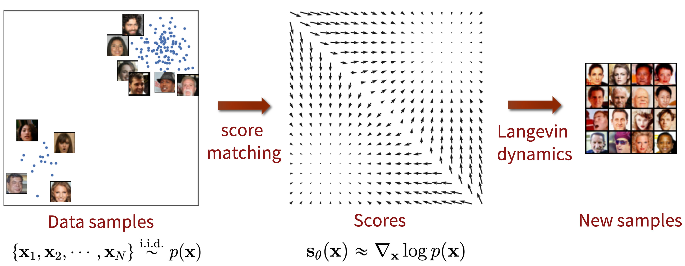
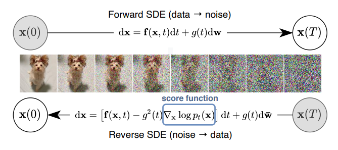
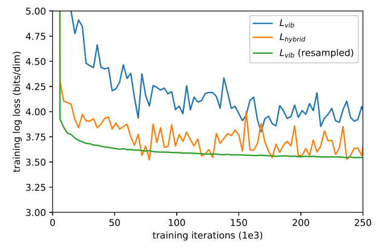

# Diffusion Model Timeline and Key Papers

## Table of Contents

* [Introduction](#introduction)
* [1 Foundational Theory and Early Pioneering Works (2015–2019)](#1-foundational-theory-and-early-pioneering-works-2015–2019)

  * [2015 — Sohl-Dickstein et al. (Deep Unsupervised Learning using Nonequilibrium Thermodynamics)](#2015—sohl-dickstein-et-al-deep-unsupervised-learning-using-nonequilibrium-thermodynamics)
  * [2019 — Y. Song & E. Ermon (Score-based generative modeling / NCSN)](#2019—y-song--e-ermon-score-based-generative-modeling--ncsn)
* [2 Core Diffusion Models](#2-core-diffusion-models-2020–2021)

  * [2020 — Ho et al. (DDPM)](#2020—ho-et-al-denoising-diffusion-probabilistic-models)
  * [2020 — Song et al. (Score-Based Generative Modeling through SDEs)](#2020—song-et-al-score-based-generative-modeling-through-sdes)
  * [2020 — Song et al. (DDIM)](#2020—song-et-al-denoising-diffusion-implicit-models)
  * [2021 — Nichol & Dhariwal (Improved DDPM)](#2021—nichol--dhariwal-improved-denoising-diffusion-probabilistic-models)
  * [2021 — Dhariwal & Nichol (Diffusion Models Beat GANs)](#2021—dhariwal--nichol-diffusion-models-beat-gans-on-image-synthesis)
  * [2021 — Ho et al. (Classifier-Free Guidance)](#2021—ho-et-al-classifier-free-diffusion-guidance)
  * [2023 - Loss-Guided Diffusion](#loss-guided-diffusion-icml-2023)
  * [2023 - universal guidance for diffusion models](#universal-guidance-for-diffusion-models)
* [3 Specific Applications of Diffusion Models](#3-specific-applications-of-diffusion-models)

  * [3.1 Image Generation from Text Descriptions](#31-image-generation-from-text-descriptions)

    * [Stable Diffusion (Rombach et al.)](#stable-diffusion-rombachetal)
    * [DALL·E 2 (Ramesh et al.)](#dall·e-2-ramesh-et-al)
    * [Imagen (Saharia et al.)](#imagen-saharia-et-al)
  * [3.2 Language Generation](#32-language-generation)
  * [3.3 Physical Control Systems & Planning](#33-physical-control-systems--planning)

    * [CSDI (Tashiro et al.)](#csdi-tashiro-et-al)
    * [Decision Diffuser / Ajay et al.](#decision-diffuser-ajay-et-al)
    * [Diffuser (Janner et al.)](#diffuser-janner-et-al)
    * [Diffusion Policy (Chi et al.)](#diffusion-policy-chi-et-al)
    * [TSGM (Nikitin et al.)](#tsgm-nikitin-et-al)
    * [DiffPhyCon (Wei et al.)](#diffphycon-wei-et-al)
    * [CL-DiffPhyCon (Wei et al.)](#cl-diffphycon-wei-et-al)
    * [DPPO (Ren et al.)](#dppo-ren-et-al)
    * [Diffuse-CLoC (Huang et al.)](#diffuse-cloc-huang-et-al)
* [Appendix](#Appendix)
  * [Unet](#unet)

---
  

# Introduction

扩散模型是一类强大的生成式框架，它们通过学习噪声注入过程的逆过程来从复杂的数据分布中采样。这使得它们在需要分布匹配的任务上表现得尤为出色——例如文本生成、图像合成、音频/音乐生成、视频生成与预测、分子设计与药物发现、逆问题与重建、数据增强与去噪等。

---

# 1. Foundational Theory and Early Pioneering Works (2015–2019)

## **2015 arXiv (ICML 2015): “Deep Unsupervised Learning using Nonequilibrium Thermodynamics” (Sohl-Dickstein et al.)**

> [Paper](https://arxiv.org/abs/1503.03585) & [Video](https://www.youtube.com/watch?v=XLzhbXeK-Os) & [Code](https://github.com/Sohl-Dickstein/Diffusion-Probabilistic-Models/tree/master)

作者首先提出了一个扩散模型框架。受非平衡统计物理的启发，他们定义了一个前向扩散过程，将任意复杂的数据分布转换为一个简单且解析可处理的分布（例如零均值、单位协方差的高斯分布），然后训练一个神经网络去学习该扩散过程在有限时间内的逆过程，该逆过程定义了生成模型的分布。

**证据下界（ELBO）的推导**：将似然最大化转换为对数似然最大化 $\mathcal L=\mathbb{E}\_{q(x^{(0)})}\[\log p(x^{(0)})]$，以便利用詹森不等式将 $\log\int$ 转换为可计算的 $\int\log$ 的下界，然后将该下界按时间步分解，使得每一项都成为一个 KL 散度。

**优化目标与训练**：通过将每个逆向扩散核视为一个参数化模型，核心训练目标就变为寻找每一步逆向核的均值和协方差函数的最优参数，以最大化该对数似然下界。这等价于同时最小化每一步逆向核与真实后验之间的 KL 散度。这样，估计一个复杂分布的问题就简化为预测每个逆向扩散步骤所需的参数。

> 把生成问题转化为对前向扩散逆过程的学习，相比直接建模数据分布有如下优势：训练稳定性、明确化的训练目标（ELBO）、可控采样过程、与物理直觉的联系。

## **2019 arXiv (NeurIPS 2019): “Generative Modeling by Estimating Gradients of the Data Distribution” (Y. Song & E. Ermon)**

> [Paper](https://arxiv.org/abs/1907.05600) & [Blog](http://yang-song.net/blog/2021/score/) & [Video](https://www.youtube.com/watch?v=8TcNXi3A5DI) & [Code](https://github.com/ermongroup/ncsn) & [Summary Video](https://www.youtube.com/watch?v=wMmqCMwuM2Q)

作者提出了一种基于 score 的生成建模框架。在该框架中，他们首先通过 score matching 来估计数据对数密度的梯度 $\nabla\_x \log p\_{\rm data}(x)$，然后在采样阶段利用 Langevin 动力学：在每次迭代中沿着所学得的 score 方向迈出小步，同时注入噪声。通过这种方式，随机噪声会在学习到的对数密度景观上逐步“爬升”到高概率区域，从而生成逼真的新样本。

**关于 score 函数的说明**：与统计学中常见的 score 函数不同，score matching 中的 score 是对输入 $x$ 的梯度，而不是对模型参数 $\theta$ 的梯度。在这里，score 函数是一个向量场，指示了密度函数增长最快的方向。

**基于 score 的建模框架的核心思想**：Langevin 动力学仅依赖于 score 函数 $\nabla\_{\mathbb x} \log p(\mathbb x)$，即可从某个概率密度 $p(\mathbb x)$ 中生成样本。为了从数据分布 $p\_\text{data}(\mathbb x)$中获得样本，需要首先训练一个 score 网络，使得 $\mathbb s\_\theta(\mathbb x) \approx \nabla\_x \log p\_\text{data}(\mathbb x)$，然后使用 $\mathbb s\_\theta(\mathbb x)$ 在 Langevin 动力学中近似采样。

**改进的基于 score 的生成建模**：研究者观察到，用高斯噪声扰动数据会让分布更适合基于 score 的生成建模。因此，他们在多个噪声水平上对数据进行破坏，然后训练一个噪声条件 score 网络（NCSN），即
$s\_\theta(x,\sigma)\approx\nabla\_x\log q\_\sigma(x)$ 以同时估计所有噪声尺度下的 score。该网络采用了 U-Net 架构，结合了 空洞卷积（dilated convolution），并使用 instance normalization。在训练好 NCSN $s\_\theta(x,\sigma)$ 后，作者受到模拟退火与退火重要性采样的启发，提出了一种新的采样过程——退火 Langevin 动力学。直观上，他们希望逐步降低数据分布的“温度”，以逐渐减小噪声水平。

> score matching 相比于最大似然估计，避免了直接计算归一化常数，等价于最小化 Fisher divergence。结合 Langevin dynamics，噪声注入保证探索，梯度引导朝向高密度区域。
---

# 2. Core Diffusion Models (2020–2021)

## **2020 arXiv (NeurIPS 2020): “Denoising Diffusion Probabilistic Models” (Ho et al.)**

> [Paper](https://arxiv.org/abs/2006.11239) & [Website](https://hojonathanho.github.io/diffusion/) & [Video](https://slideslive.com/38936172) & [Code (official Tensorflow version)](https://github.com/hojonathanho/diffusion) & [Code (Pytorch version)](https://github.com/lucidrains/denoising-diffusion-pytorch) & [An In-Depth Guide Blog](https://learnopencv.com/denoising-diffusion-probabilistic-models/)

作者从理论上证明了：变分推断目标（最大化对数似然）与基于噪声预测的均方误差训练在数学上是等价的，从而统一了这两种视角。从**变分推断**的角度来看，DDPM 将对数似然下界（VLB）分解为一系列 KL 散度。从 **score matching** 的角度来看，网络在预测加入的噪声时，实际上隐式地对每个带噪数据分布执行了 score matching。在高斯前向过程假设下，变分下界（VLB）里的 KL 项化简为噪声预测的 MSE，这统一了变分推断视角和 score matching 视角。

变分推断视角目标是最大化数据对数似然 $\log p_\theta(x_0)$，DDPM 引入潜变量序列 $(x_1, x_2, \dots, x_T)$，定义前向扩散分布 $q(x_t|x_{t-1})$，并构造对数似然下界（VLB）：

$$
\log p_\theta(x_0) \geq \mathbb E_q \Big[ \log p_\theta(x_T) + \sum_{t=1}^T \log \frac{p_\theta(x_{t-1}|x_t)}{q(x_{t-1}|x_t, x_0)} \Big]
$$

这可以分解为一系列 KL 散度，其中关键项是：

$$
\mathrm{KL}\big(q(x_{t-1}|x_t, x_0)\, \|\, p_\theta(x_{t-1}|x_t)\big)
$$

在 DDPM 中，前向过程是高斯噪声注入：

$$
q(x_t|x_0) = \mathcal N\big(\sqrt{\bar\alpha_t}x_0,(1-\bar\alpha_t)I\big)  
$$

因此，真实后验 $q(x_{t-1}|x_t, x_0)$ 也是高斯，可以写出均值的闭式解。模型的近似分布 $p_\theta(x_{t-1}|x_t)$ 同样假设为高斯，均值由神经网络给出。

如果让网络直接预测 **噪声** $\epsilon$，那么预测的均值可以写成：

$$
\mu_\theta(x_t,t) = \frac{1}{\sqrt{\alpha_t}} \Big(x_t - \frac{1-\alpha_t}{\sqrt{1-\bar\alpha_t}} \, \epsilon_\theta(x_t,t)\Big)
$$

将这个形式代入 KL 散度，可以化简得到：

$$
\mathcal L_t = \mathbb E_{x_0,\epsilon,t}\Big[\|\epsilon - \epsilon_\theta(x_t,t)\|^2\Big] + \text{常数}
$$

即 **最小化 KL 散度等价于最小化噪声预测的均方误差（MSE）**。
  

> 为什么社区更常用噪声预测而不是直接预测 $x_0$？  
> 直接预测 $x_0$ 对高噪声时间步 $t$ 敏感， $x_t$ 噪声很大直接回到 $x_0$ 太难，训练不稳定。而噪声预测网络只需学习噪声分布，而不是直接映射到干净样本，此外，数学上与 score matching 等价，训练目标理论上更稳健。

## **2020 arXiv (ICLR 2021): “Score-Based Generative Modeling through SDEs” (Song et al.)**

> [Paper](https://arxiv.org/pdf/2011.13456) & [OpenReview](https://openreview.net/forum?id=PxTIG12RRHS) & [Video](https://iclr.cc/virtual/2021/poster/3177) & [Blog](http://yang-song.net/blog/2021/score/) & [Code (Tensorflow version)](https://github.com/yang-song/score_sde) & [Code (Pytorch version)](https://github.com/yang-song/score_sde_pytorch)

通过将传统的离散噪声扰动过程提升为连续时间的**随机微分方程**（SDE）视角，这项工作把各种基于 score 的生成模型（例如 SMLD 和 DDPM）统一到一个框架下。具体来说，把数据转换为一个简单的噪声分布可以用一个连续时间的 SDE 来完成，并且根据 Anderson（1982）的结果，如果我们知道每个中间时间步的分布的 score（即 \$\nabla\_x \log p\_t(x)\$），那么该 SDE 可以被反向化（reverse）。为了训练 score 网络 \$s\_\theta(x, t)\approx \nabla\_x \log p\_t(x)\$，作者提出了一个统一的基于 SDE 的目标，使用加权的去噪 score matching（weighted DSM）。
  

通过设计不同的函数 \$f(t)\$ 和 \$g(t)\$，可以实现各种已知模型：当 \$f = 0\$, \$g(t) = \sqrt{2\beta(t)}\$ 时，对应方差保持（Variance Preserving, VP）SDE，这与 DDPM 等价；当 \$f = -\frac{1}{2}\beta(t)\mathbf{x}\$, \$g(t) = \sqrt{\beta(t)}\$ 时，对应方差爆炸（Variance Exploding, VE）SDE，与最初的 score-based 模型（如 NCSN）相匹配。也可以定义新的扩散路径，例如 sub-VP。

他们展示了可以将任何 SDE 转换为一个常微分方程（ODE）而不改变其边缘分布。通过求解该 ODE，可以从与反向 SDE 相同的分布中采样。该 SDE 对应的 ODE 被称为**概率流 ODE**（probability flow ODE）。

作者将各种采样方法统一在 SDE 框架下：反向 SDE 可以用通用的 SDE 求解器（如 Euler–Maruyama 或 随机 Runge–Kutta）来求解。他们提出的 Predictor–Corrector（PC）采样器，将祖先采样（例如 DDPM 的做法）作为预测器（predictor）步骤，而将 Langevin MCMC（例如 SMLD 的做法）作为校正器（corrector）步骤，在每一步对样本进行细化。此外，他们引入了概率流 ODE 采样器——一个确定性的生成过程，允许精确计算似然并实现路径一致的、可控的生成。

最后，论文给出了一种条件生成的方法，通过将分类器的梯度 \$\nabla\_{\mathbf{x}} \log p\_\phi(y|\mathbf{x})\$ 融入反向 SDE 或 ODE，从而实现**分类器引导**（classifier guidance），将生成过程导向所需类别。

## **2020 arXiv (ICLR 2021): “Denoising Diffusion Implicit Models” (Song et al.)**

> [Paper](https://arxiv.org/abs/2010.02502) & [OpenReview](https://openreview.net/forum?id=St1giarCHLP) & [Video](https://slideslive.com/38953675) & [Code](https://github.com/ermongroup/ddim)

作者设计了一族**跳步**（skip-step）噪声注入过程，由参数 \$\sigma\$ 参数化，虽然在关键时间步注入的噪声量与 DDPM 相同，但这些过程**不再要求严格的马尔可夫性**（即不必一步一步通过所有中间步骤）。

他们进一步证明，无论选择哪种由 \$\sigma\$ 参数化的跳步噪声注入过程，训练时所要最小化的变分下界目标在数值上与 DDPM 中使用的 \$L\_1\$ 近似损失完全相同。换句话说，只需用标准流程训练模型一次，然后在采样时可以自由切换不同的噪声注入/去噪轨迹而无需重新训练。

![Figure 8. Graphical model for accelerated generation, where \$\tau=\[1, 3\]\$.](./assets/figure8.png)

这允许仅在选定的子序列 \${\tau\_1,\dots,\tau\_S}\$ 上执行前向噪声注入与反向去噪，这样当 \$S\ll T\$ 时，可以在保持高样本质量的同时实现 10×–100× 的加速，无需重训练。

## **2021 arXiv (ICML 2021): “Improved Denoising Diffusion Probabilistic Models” (Nichol & Dhariwal)**

> [Paper](https://arxiv.org/abs/2102.09672) & [OpenReview](https://openreview.net/forum?id=-NEXDKk8gZ) & [Code](https://github.com/openai/improved-diffusion)

本文提出了一系列针对 DDPM 的改进，旨在提高对数似然性能。

**学习方差**：作者首先指出尽管方差对于样本质量的重要性不及均值，但扩散过程的初始步骤对变分下界（VLB）的贡献最大。为改进对数似然，作者在对数域中将方差参数化为理论最优反向方差 \$\tilde \beta\_t\$ 与前向过程方差 \$\beta\_t\$ 之间的插值。引入一个**混合目标** $L_\text{hybrid}$，用于联合优化简化的 DDPM 目标 \$L\_\text{simple}\$（用于**噪声预测**）与 VLB \$L\_\text{vlb}\$（用于**似然优化**）。在该设置下， \$L\_\text{simple}\$ 作为更新均值网络 \$\mu\_\theta\$ 的主要信号，而通过对 \$\mu\_\theta\$ 应用 stop-gradient，确保 \$L\_\text{vlb}\$ 仅指导方差网络 \$\Sigma\_\theta\$ 的更新。

**改进噪声调度（Noise Schedule）**：作者提出了一种余弦（cosine）噪声时间表，使用平方余弦函数控制累积噪声水平 \$\bar \alpha\_t\$，确保在扩散过程的开始与结束阶段变化平缓，避免噪声骤增或信息过早破坏，同时允许中间阶段更快的变化。

**减少梯度噪声**：作者确认 \$L\_\text{vlb}\$ 中不同项量级差异很大是造成梯度噪声的来源。为此，他们采用一种**重要性采样策略**，基于每个损失项历史均方值动态调整采样概率，从而显著减少梯度噪声。该方法使得直接优化 \$L\_\text{vlb}\$ 成为可行，并在训练过程中实现比混合目标 \$L\_\text{hybrid}\$ 更平滑且更优的对数似然性能。

## **2021 arXiv (NeurIPS 2021): “Diffusion Models Beat GANs on Image Synthesis” (Dhariwal & Nichol)**

> [Paper](https://arxiv.org/abs/2105.05233) & [OpenReview](https://openreview.net/forum?id=AAWuCvzaVt) & [Video](https://slideslive.com/38967263) & [Code](https://github.com/openai/guided-diffusion)

作者展示了通过一系列消融研究找到更好的架构后，扩散模型在无条件图像合成上能够超越 GAN。改进主要集中于在 DDPM 的 **U-Net 架构基础上增加模型深度与宽度、增加更多注意力头**，并在多个分辨率上使用注意力机制。
  
对于带条件的图像合成，他们进一步用**分类器引导**提高样本质量。其思路是：如果数据集带有类别标签，可以**在带噪样本上训练一个分类器** \$p\_\phi(y|x\_t, t)\$，然后在反向扩散采样过程中使用该分类器的梯度 \$\nabla\_{x\_t}\log p\_\phi(y|x\_t, t)\$ 来引导生成，使其生成指定类别的图像。

若已有一个能够预测样本所加噪声的模型 $\epsilon_\theta(x_t)$，则可由基于得分（score）的条件化技巧导出其得分函数： $\nabla_{x_t} \log p_\theta(x_t) = -\frac{1}{\sqrt{1 - \bar\alpha_t}} \epsilon_\theta(x_t)$，将其代入联合分布 $p_\theta(x_t) p_\phi(y\mid x_t)$ 的得分计算中：

$$
\begin{aligned}
\nabla_{x_t}\log\bigl(p_\theta(x_t) p_\phi(y\mid x_t)\bigr)
&= \nabla_{x_t}\log p_\theta(x_t) + \nabla_{x_t}\log p_\phi(y\mid x_t)\\
&= -\frac{1}{\sqrt{1 - \bar\alpha_t}} \epsilon_\theta(x_t) + \nabla_{x_t}\log p_\phi(y\mid x_t).
\end{aligned}
$$

最后，定义一个新的噪声预测器 $\hat\epsilon(x_t)$，对应于联合分布的得分映射： $\hat\epsilon(x_t):= \epsilon_\theta(x_t) - \sqrt{1 - \bar\alpha_t} \nabla_{x_t}\log p_\phi(y\mid x_t).$

具体而言，在每个去噪采样步骤，只需在无条件模型预测的均值 \$\mu\$ 上加上由分类器梯度 \$g\$ 与模型方差 \$\Sigma\$ 决定的偏移项 \$\Sigma g\$，从而将生成过程引导到所需类别。

> classifier 是一个普通的判别模型，输入 $x$，输出每个条件 $c$ 的概率 $p(c \mid x)$。生成过程里，我们选择一个目标条件 $c^\*$，并计算梯度 $\nabla_x \log p(c^\* \mid x)$。所以模型知道要引导生成向哪个条件靠近，因为这个条件被用作梯度的目标。  
> 小结：分类器梯度 $\nabla_x \log p(c^\* \mid x)$ 是对输入 $x$ 的梯度，而不是模型内部参数的梯度，它告诉我们如何改变 $x$ 才能增加 $x$ 属于条件 $c^\*$ 的概率。

* **2021 arXiv (NeurIPS 2021): “Classifier-Free Diffusion Guidance” (Ho et al.)**

  > [Paper](https://arxiv.org/abs/2207.12598) & [OpenReview](https://openreview.net/forum?id=qw8AKxfYbI) & [Code](https://github.com/lucidrains/classifier-free-guidance-pytorch) & [Blog](https://sander.ai/2022/05/26/guidance.html)

  由于分类器必须在带噪数据上训练，因此通常无法直接插入一个预训练的分类器进行引导。**无分类器引导**的做法是混合联合训练的**条件扩散模型**和**无条件扩散模型**的 score 估计。作者用一个网络同时参数化两个模型：对于无条件模型，可以在类别标识符 \$\mathbb c\$ 输入位置放入空标记 \$\varnothing\$。他们通过在训练时以某个概率 \$p\_\text{uncond}\$ 随机将 \$\mathbb c\$ 设为 \$\varnothing\$ 来联合训练有条件与无条件模型。

  

  采样时，他们使用条件与无条件 score 估计的线性组合进行生成。

  

* **ICML 2023: “Loss-Guided Diffusion Models for Plug-and-Play Controllable Generation” (Song et al.)**

  > [Paper](https://icml.cc/virtual/2023/poster/24571)

  只要我们能在每一步计算预测去噪样本 \$\hat{x}\_t\$ 上定义的损失 \$\ell\_y(\hat{x}\_t)\$ 及其梯度 \$\nabla\_{\hat{x}\_t}\ell\_y\$，就可以为当前的采样状态 \$x\_t\$ 在任意时间 \$t\$ 提供一个引导方向。

  扩散模型的去噪过程会逐步将噪声从 \$x\_T\$ 移除到 \$x\_0\$。在每一步，给定当前 \$x\_t\$，扩散模型可以预测相应的干净样本 \$\hat{x}\_t \approx \mathbb{E}\[x\_0 \mid x\_t]\$，这就是 MMSE 点估计。一旦得到 \$\hat{x}\_t\$，我们可以：

  * **计算 \$\ell\_y(\hat{x}\_t)\$：** 衡量其与条件 \$y\$ 的匹配程度；
  * **计算梯度 \$\nabla\_{\hat{x}\_t}\ell\_y\$：** 指示如何移动 \$\hat{x}\_t\$ 以更好地满足条件；
  * **将该梯度反向传播到 \$x\_t\$：** 引导扩散模型的采样方向。

  那么引导方向从何而来？在实践中我们计算 \$\nabla\_{x\_t}\ell\_y(\hat{x}\_t(x\_t)) = \frac{\partial \hat{x}\_t}{\partial x\_t}^\top \nabla\_{\hat{x}\_t}\ell\_y\$，其中 \$\frac{\partial \hat{x}\_t}{\partial x\_t}\$ 是通过扩散模型的预测网络反向传播得到的雅可比（梯度通道）。通过这种方式，在 \$\hat{x}\_t\$ 上定义的损失被“拉回”到当前状态 \$x\_t\$，使采样轨迹逐渐朝向所需条件移动。

* **2023 arXiv (ICLR 2024): “Universal Guidance for Diffusion Models” (Bansal et al.)**

  > [Paper](https://arxiv.org/abs/2302.07121) & [Code](https://github.com/arpitbansal297/Universal-Guided-Diffusion)

---

## 3. Specific Applications of Diffusion Models

### 3.1 Image Generation from Text Descriptions

* **2021 arXiv (CVPR 2022): “High-Resolution Image Synthesis with Latent Diffusion Models” (Rombach et al.)** (Stable Diffusion)

  > [Paper](https://arxiv.org/abs/2112.10752) & [Video](https://www.youtube.com/watch?v=-3EkERbcZns) & [Video](https://www.youtube.com/watch?v=7W4aZObNucI) & [Code](https://github.com/CompVis/latent-diffusion)

  扩散模型属于基于似然的模型类别，其覆盖模式（mode-covering）行为会使得模型倾向于把大量容量（及计算资源）花在建模数据中不可察觉的细节上。为降低训练与采样的计算复杂度，作者引入了将**感知压缩**（perceptual compression）与**生成学习**阶段明确分离的做法。

  

  为实现这一点，他们使用了一个自编码模型，学习出一个**在感知上等同于图像空间但计算复杂度显著降低的潜在空间**。形式上，可以用条件去噪自编码器 \$\epsilon\_\theta(z\_t, t, y)\$ 实现条件分布 \$p(z|y)\$。更灵活的方式是通过**在基础 U-Net 上加入 cross-attention 机制**，这对学习基于注意力的多模态条件（例如文本）非常有效。

  

* **2022 arXiv: “Hierarchical Text-Conditional Image Generation with CLIP Latents” (Ramesh et al.)** (DALL·E 2)

  > [Paper](https://arxiv.org/abs/2204.06125) & [Website](https://openai.com/index/dall-e-2/) & [Video](https://www.youtube.com/watch?v=TvBjoN3zkPY) & [Code](https://github.com/lucidrains/DALLE2-pytorch)

* **2022 arXiv (NeurIPS 2022 Outstanding Paper Award): “Photorealistic Text-to-Image Diffusion Models with Deep Language Understanding” (Saharia et al.)** (Imagen)

  > [Paper](https://arxiv.org/abs/2205.11487) & [OpenReview](https://openreview.net/forum?id=08Yk-n5l2Al) & [Website](https://imagen.research.google/)

---

### 3.2 Language Generation

* **2022 arXiv (NeurIPS 2020): “Language Models are Few-Shot Learners” (Brown et al.)** (GPT-3)

  > [Paper](https://arxiv.org/abs/2005.14165)

---

### 3.3 Physical Control Systems & Planning

* **2021 arXiv (NeurIPS 2021): “CSDI: Conditional Score-based Diffusion Models for Probabilistic Time Series Imputation” (Tashiro et al.)**

  > [Paper](https://arxiv.org/abs/2107.03502) & [OpenReview](https://openreview.net/forum?id=VzuIzbRDrum) & [Code](https://github.com/ermongroup/CSDI)

  
  

* **2022 arXiv (ICLR 2023): “Is Conditional Generative Modeling all you need for Decision-Making?” (Ajay et al.)**

  > [Paper](https://arxiv.org/abs/2211.15657) & [Video](https://iclr.cc/virtual/2023/oral/12696) & [Website](https://anuragajay.github.io/decision-diffuser/) & [Code](https://github.com/anuragajay/decision-diffuser)

  该工作的重要贡献在于展示条件扩散策略在无需动态规划的情况下可以超越传统的离线强化学习方法，同时支持多重约束与技能组合。

  作者证明当动作轨迹不平滑时，仅对状态序列进行扩散然后通过逆动力学模型预测动作（即先规划状态轨迹，再通过逆动力学推导动作）优于同时对状态与动作联合扩散。具体而言，该方法首先对状态序列进行扩散以生成最优状态轨迹。随后，对于轨迹中任意相邻两帧状态 \$s\_t\$ 和 \$s\_{t+1}\$，使用逆动力学模型估计实现该状态转移所需的动作。该**先规划路径，再推导动作**的范式是 Decision Diffuser 等方法区别于传统强化学习与直接动作生成方法的关键创新。

  

  他们直接训练一个以轨迹回报 \$y(\tau)\$ 为条件的扩散模型（基于离线数据集），并结合无分类器引导与低温采样来提取高似然轨迹。具体地，他们先将回报 \$R(\tau)\$ 归一化到 $\[0,1]\$，然后以条件 \$R(\tau)=1\$ 采样以获得高回报轨迹。为生成满足某一约束 \$C\_i\$ 或展示特定技能的轨迹，他们将噪声模型条件化为该约束或技能的 one-hot 编码。

* **2022 arXiv (ICML 2022): “Planning with Diffusion for Flexible Behavior Synthesis” (Janner et al.)**

  > [Paper](https://arxiv.org/abs/2205.09991) & [Video](https://icml.cc/virtual/2022/oral/18292) or [Video (YouTube)](https://www.youtube.com/watch?v=ViBkYHg4rPI) & [Code](https://github.com/jannerm/diffuser) & [Website](https://diffusion-planning.github.io/)

  该工作的核心贡献是提出了一个适用于轨迹数据的去噪扩散模型及其概率框架——Diffuser，能够**同时预测整个计划的所有时间步**。
  

* **2023 arXiv (IJRR 2024): “Diffusion Policy: Visuomotor Policy Learning via Action Diffusion” (Chi et al.)**

  > [Paper](https://arxiv.org/abs/2303.04137) & [Video](https://www.youtube.com/watch?v=M03sZFfW-qU) & [Code](https://github.com/real-stanford/diffusion_policy) & [Website](https://diffusion-policy.cs.columbia.edu/)

  作者提出了一种新的机器人视觉运动策略形式，该策略通过在机器人动作空间上进行“条件去噪扩散过程”来生成行为，称为 Diffusion Policy。策略并非直接输出动作，而是在 $K$ 次去噪迭代中推断动作的 score 梯度，且以视觉观测作为条件。

  

  

* **2023 arXiv (NeurIPS 2024): “TSGM: A Flexible Framework for Generative Modeling of Synthetic Time Series” (Nikitin et al.)**

  > [Paper](https://arxiv.org/abs/2305.11567) & [Video](https://neurips.cc/virtual/2024/poster/97532) & [Code](https://github.com/AlexanderVNikitin/tsgm) & [Website](https://tsgm.readthedocs.io/en/latest/)

  该工作研究了基于扩散方法的时间序列生成问题。TSGM 架构包含三部分：编码器、解码器和条件 score-matching 网络。预训练的编码器用于将底层时间序列嵌入到潜在空间，条件 score-matching 网络用于对隐藏状态进行采样，然后通过解码器将其转换为时间序列样本。

* **2024 arXiv (NeurIPS 2024): “DiffPhyCon: A Generative Approach to Control Complex Physical Systems” (Wei et al.)**

  > [Paper](https://web3.arxiv.org/abs/2407.06494) & [Video](https://neurips.cc/virtual/2024/poster/95505) & [Code](https://github.com/AI4Science-WestlakeU/diffphycon) & [Website](https://ai4s.lab.westlake.edu.cn/publications/2024/10/04/DiffPhyCon-A-Generative-Approach-to-Control-Complex-Physical-Systems.html)

  介绍了一种名为 DiffPhyCon 的新方法，该方法利用生成模型通过最小化学习到的生成能量函数和指定的控制目标来控制复杂物理系统。此外，作者通过**先验重加权**增强了 DiffPhyCon，能够发现显著偏离训练分布的控制序列。

  欢迎加入作者团队哟，[传送门](https://mp.weixin.qq.com/s?__biz=Mzk0ODU2OTQ0Nw==&mid=2247485740&idx=1&sn=5331d8bf5efcb44172345e2101908216&chksm=c2c3fb893f033dadc00a09e39ae3037c671bfe4c1384c27deddf92c4fbfc25ccf28563a12d57&mpshare=1&scene=1&srcid=0423E4utttD0HGuLnHB4E3Us&sharer_shareinfo=f2fe6cbaa976c96e8c9c459a5f4486ca&sharer_shareinfo_first=6ca23b4ef88437fa6f812f2885f083cb#rd)带你去见一群真诚有趣有实力的人~
  

* **2024 arXiv (ICLR 2025): “CL-DiffPhyCon: Closed-loop Diffusion Control of Complex Physical Systems” (Wei et al.)**

  > [Paper](https://arxiv.org/abs/2408.03124) & [Video](https://iclr.cc/virtual/2025/poster/29738) & [Code](https://github.com/AI4Science-WestlakeU/CL_DiffPhyCon) & [Website](https://ai4s.lab.westlake.edu.cn/publications/2025/01/24/Closed-loop-Diffusion-Control-of-Complex-Physical-Systems.html)

  CL-DiffPhyCon 通过**异步去噪框架**显著降低了采样过程中的计算成本。与现有的基于扩散的控制方法相比，CL-DiffPhyCon 能够在更短的时间内生成高质量的控制信号。并且 CL-DiffPhyCon 实现了闭环控制，根据实时环境反馈调整策略。在控制效果方面，它优于开环基于扩散的规划方法。
  

* **2024 arXiv (ICLR 2025): “Diffusion Policy Policy Optimization” (Ren et al.)**

  > [Paper](https://arxiv.org/abs/2409.00588) & [Video](https://iclr.cc/virtual/2025/poster/28475) & [Code](https://github.com/irom-princeton/dppo) & [Website](https://diffusion-ppo.github.io/)

* **2025 arXiv (ICLR 2025): “Diffuse-CLoC: Guided Diffusion for Physics-based Character Look-ahead Control” (Huang et al.)**

  > [Paper](https://arxiv.org/abs/2503.11801) & [Video]() & [Code](https://www.youtube.com/watch?v=iTYs83WtGB4) & [Website](https://diffusecloc.github.io/website/)

  

  **同一个预训练扩散模型应用不同的引导技术**：在训练阶段，他们独立随机采样状态和动作去噪的时间步，使轨迹的噪声水平具有多样性。模型通过最小化均方误差损失来学习通过预测干净轨迹进行去噪。接着，在推理条件化时，他们使用分类器引导来完成新的下游任务。对于每个扩散步骤，他们将步 $K$ 时的带噪轨迹输入模型以预测干净轨迹与噪声；然后基于预测状态与环境信息计算任务特定的代价与梯度，这些梯度会修改预测的噪声，从而确定下一步去噪的均值，并迭代地对下一个带噪轨迹进行采样。

  

## Appendix

* **2015 arXiv (MICCAI 2015): “U-Net: Convolutional Networks for Biomedical Image Segmentation” (Ronneberger et al.)**

  > [Paper](https://arxiv.org/abs/1505.04597) & [Video](https://www.youtube.com/watch?v=81AvQQnpG4Q) & [Talk](https://www.youtube.com/watch?v=UahLCWtJEq8) & [Code](https://github.com/milesial/Pytorch-UNet) & [Website](https://lmb.informatik.uni-freiburg.de/people/ronneber/u-net)

  

  U-Net 的两个路径分别是：**收缩路径**（contraction path / encoder）和**扩展路径**（expansion path / decoder）。它们的职责互补：前者负责 “**Increase the What, reduce the where**”，逐步抽取语义特征并扩大感受野，后者负责 “**Create high-resolution segmentation map**”，逐步恢复空间分辨率以实现像素级分割。两者通过**跳跃连接**（skip connections）在相同尺度处拼接特征，保证高层语义与低层空间细节同时被利用。

  具体地，
  - 横向看，每一层，层内**无填充**卷积：2 × (Conv3×3 → ReLU)，对应 `H×W` → `(H-2)×(W-2)` → `(H-4)×(W-4)`；跳跃连接**拼接**（Concatenate）相同 level 的层，把上采样得到的特征与 encoder 中相同尺度的特征在通道方向拼接 `concat([up_feat, enc_feat])`，注意对 encoder 特征做**中心裁剪**（center-crop）以匹配上采样后的尺寸，通道数变成 `C_up + C_enc`；
  - 纵向看，从上往下是**下采样**（Downsample，通常是 MaxPool 2×2），下采样对应输入尺寸减半 `H×W` → `H/2 × W/2`，但道数增大，`64`→`128`；从下往上是**上采样/上卷积**（Up-convolution），通常是 2×2 up-convolution，空间尺寸：`H/2 × W/2` → `H × W`，通道数减半。

  > **为避免裁剪麻烦**：实现时使用 `padding=1`（same convs），这样空间维度在 conv 后保持不变，不需要裁剪，代码更简洁。

* **2022 arXiv: “Convolution, aggregation and attention based deep neural networks for accelerating simulations in mechanics” (Deshpande et al.)**
  > [Paper](https://arxiv.org/abs/2212.01386)
  
  Perceiver IO结构设计了一个“跨注意力瓶颈”，将任意模态（如外力、位移）的输入通过 cross-attention 映射到一个固定尺寸的 latent 表征，再通过自注意力处理、再 cross-attention 解码到输出。这一机制允许不同“通道”（物理量）被混合建模，并处理非规则网格或高维系统，常用于仿真和力学系统建模。
  
* **“MCAF-Net: Multi-Channel Temporal Cross-Attention Network with Dynamic Gating for Sleep Stage Classification” (Xu et al.)**
  > [Paper]()

  尽管这是生理信号（EEG）任务，但很类似物理系统多通道观测。MCAF-Net 使用动态门控的跨通道多头注意力，在多个 EEG 通道之间建模相互关系（通道间依赖），这正是跨通道注意力的典型使用场景。

* **“Spatially-Aware Diffusion Models with Cross-Attention for Global Field Reconstruction with Sparse Observations” (Zhuang et al.)**
  > [Paper](https://arxiv.org/abs/2409.00230)

  这类模型使用 cross-attention 将“观测传感器位置/数值”作为条件信息，跨 token（例如时间或空间位置）与主图像或物理场特征进行融合。这是一种跨通道或跨模态的注意力形式，常用于 PDE 场重建和流体模拟。
