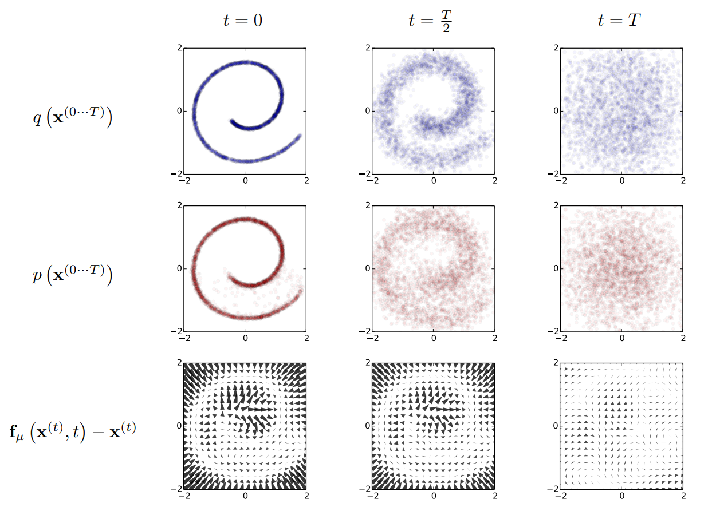

# diffusion‑model timeline and key papers
## 1. Foundational Theory and Early Pioneering Works (2015–2019)
- 2015 ICML: “Deep Unsupervised Learning using Nonequilibrium Thermodynamics” (Sohl‑Dickstein et al.)

  > [Paper](https://arxiv.org/abs/1503.03585) & [Video](https://www.youtube.com/watch?v=XLzhbXeK-Os) & [Code](https://github.com/Sohl-Dickstein/Diffusion-Probabilistic-Models/tree/master)

  Inspired by non-equilibrium statistical physics, it defines a forward diffusion process which converts any complex data distribution into a simple, analytically tractable distribution (such as a zero-mean, unit-covariance Gaussian) and then trains a neural network to learn a finite-time reversal of this diffusion process which deifnes generative model distribution.
  
    
    
  **Derivation of the Evidence Lower Bound (ELBO)**: converting likelihood maximization into log‑likelihood maximization $\mathcal L=\mathbb{E}_{q(x^{(0)})}[\log p(x^{(0)})]$, so that Jensen’s inequality can turn the daunting “log of an integral” $\log\int$ into a computable lower bound of “integral of a log” $\int\log$, then splitting that bound across time steps so that each term is a KL divergence.  

   **Optimization objective & training**: By treating each reverse diffusion kernel as a parametric model, the core training objective becomes finding the parameters of each step’s reverse kernel that maximize this log‑likelihood bound
  which means learning the optimal mean and covariance functions). In this way, estimating a complex distribution reduces to predicting the parameters needed for each reverse diffusion step.
