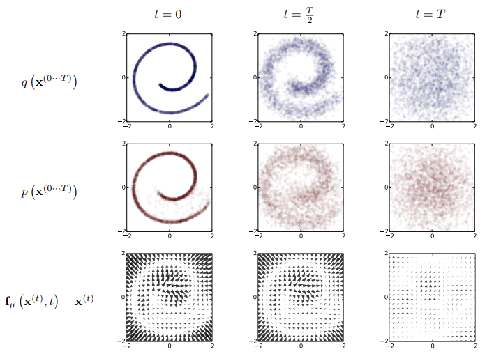
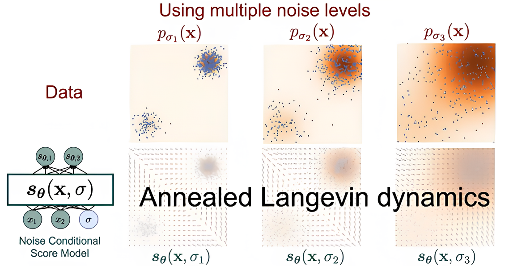
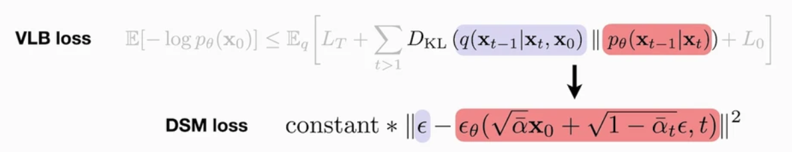
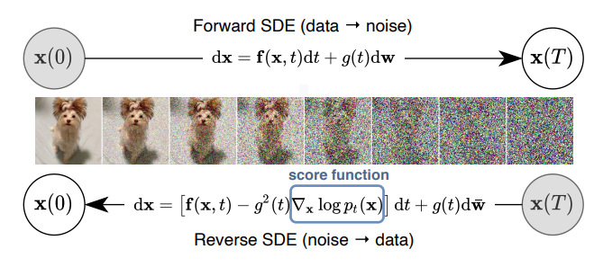
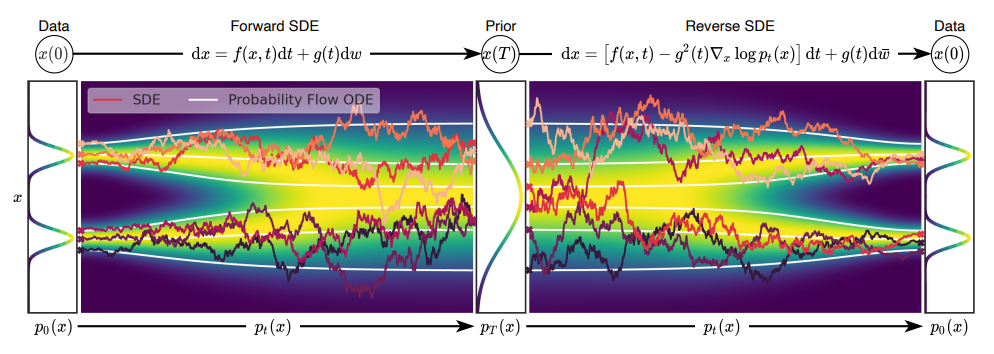
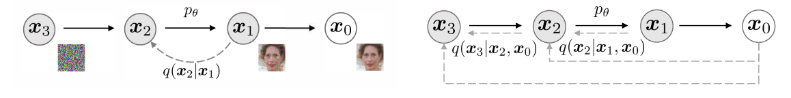
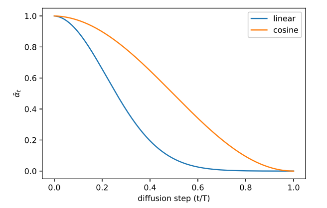
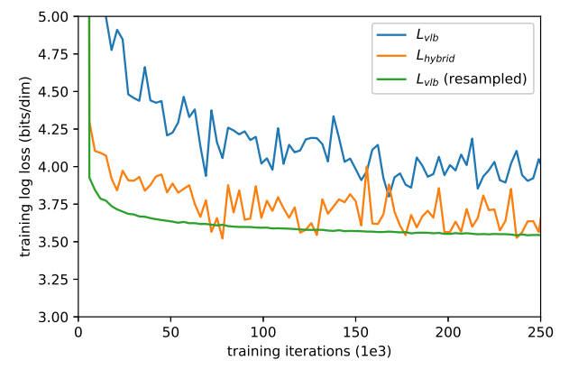
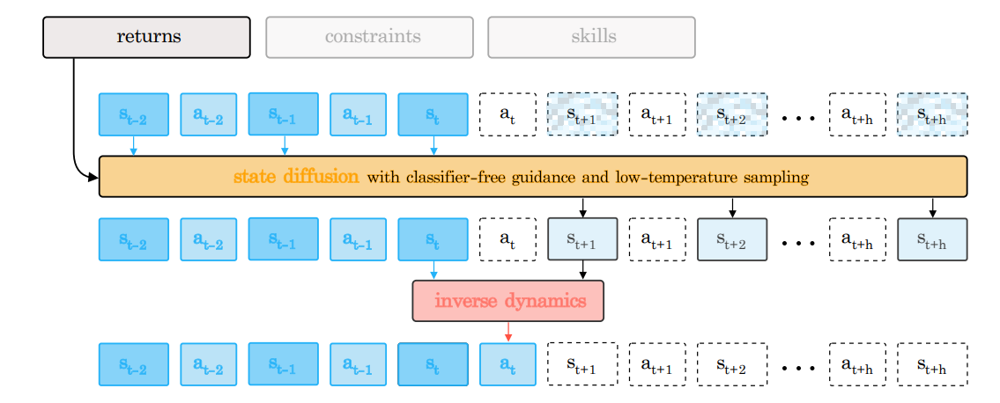

# diffusion‑model timeline and key papers

## 1. Foundational Theory and Early Pioneering Works (2015–2019)

- **2015 arXiv(ICML 2015): “Deep Unsupervised Learning using Nonequilibrium Thermodynamics” (Sohl‑Dickstein et al.)**

  > [Paper](https://arxiv.org/abs/1503.03585) & [Video](https://www.youtube.com/watch?v=XLzhbXeK-Os) & [Code](https://github.com/Sohl-Dickstein/Diffusion-Probabilistic-Models/tree/master)

  The authors first propose a diffusion‑model framework. Inspired by non-equilibrium statistical physics, they define a forward diffusion process which converts any complex data distribution into a simple, analytically tractable distribution (such as a zero-mean, unit-covariance Gaussian) and then trains a neural network to learn a finite-time reversal of this diffusion process which deifnes generative model distribution.

  
  
  **Derivation of the Evidence Lower Bound (ELBO)**: Converting likelihood maximization into log‑likelihood maximization $\mathcal L=\mathbb{E}_{q(x^{(0)})}[\log p(x^{(0)})]$, so that Jensen’s inequality can turn $\log\int$ into a computable lower bound of $\int\log$, then splitting that bound across time steps so that each term is a KL divergence.  

   **Optimization objective & training**: By treating each reverse diffusion kernel as a parametric model, the core training objective becomes finding the optimal parameters of mean and covariance functions of each step’s reverse kernel that maximize this log‑likelihood bound, which is equivalent to simultaneously minimizing the KL divergence between the reverse kernel at each step and the true posterior. In this way, estimating a complex distribution reduces to predicting the parameters needed for each reverse diffusion step.

- **2019 arXiv(NeurIPS 2019): “Generative Modeling by Estimating Gradients of the Data Distribution” (YSong & Ermon)**
  > [Paper](https://arxiv.org/abs/1907.05600) & [Blog](http://yang-song.net/blog/2021/score/) & [Video](https://www.youtube.com/watch?v=8TcNXi3A5DI) & [Code](https://github.com/ermongroup/ncsn) & [Summary Video](https://www.youtube.com/watch?v=wMmqCMwuM2Q)  
  
  The authors propose the framework of score-based generative modeling where they first estimate gradient of data log‑density, $\nabla_x \log p_{\rm data}(x)$, via score matching, and then generate samples by iteratively taking small steps in the direction of this learned score while injecting noise via Langevin dynamics. In this way, random noise “climbs” up the learned log‑density landscape into high‑probability regions, producing realistic new samples.

  

  **Working with score functions**: Unlike the statistical score function, the score in score matching is the gradient with respect to the input $x$, not the gradient with respect to the model parameters $\theta$. Here, the score function is the vector field that gives the direction where the density function grows most quickly.

  **The key idea of score-based modeling framework**: Note that Langevin dynamics can produce samples from a probability density $p(\mathbb x)$ using only the score function $\nabla_{\mathbb x} \log p(\mathbb x)$. In order to obtain samples from $p_\text{data}(\mathbb x)$, first train score network such that $\mathbb s_\theta(\mathbb x) \approx \nabla_x \log p_\text{data}(\mathbb x)$ and then approximately obtain samples with Langevin dynamics using $\mathbb s_\theta(\mathbb x)$.

  

  **Improved score-based generative modeling**: Based on the observation that perturbing data with random Gaussian noise makes the distribution more amenable to score‑based generative modeling,  first corrupt the data at multiple noise levels and then train a Noise Conditional Score Network (NCSN), $s_\theta(x,\sigma)\approx\nabla_x\log q_\sigma(x)$ to jointly estimate the scores for all noise scales. This network combines a U‑Net architecture with dilated convolutions and employs instance normalization. Once the NCSN $s_\theta(x,\sigma)$ is trained, inspired by simulated annealing and annealed importance sampling, they propose a sampling procedure—annealed Langevin dynamics, because the rough intuition is they hope to gradually anneal down the temperature of their data density to gradually reduce the noise level.

## 2. Core Diffusion Models (2020–2021)

- **2020 arXiv(NeurIPS 2020): “Denoising Diffusion Probabilistic Models” (Ho et al.)**

  > [Paper](https://arxiv.org/abs/2006.11239) & [Website](https://hojonathanho.github.io/diffusion/) & [Video](https://slideslive.com/38936172) & [Code(official Tensorflow version)](https://github.com/hojonathanho/diffusion) & [Code(Pytorch version)](https://github.com/lucidrains/denoising-diffusion-pytorch) & [An In-Depth Guide Blog](https://learnopencv.com/denoising-diffusion-probabilistic-models/)

  
  
  The authors theoretically proves that the variational inference objective (maximizing log‑likelihood) and the mean‑squared‑error training for noise prediction are mathematically equivalent, unifying the two viewpoints. From the variational inference perspective, DDPM decomposes the log‑likelihood lower bound (VLB) into a series of KL divergences. From the score‑matching perspective, the network implicitly performs score matching on each noisy data distribution by predicting the added noise. Optimizing the VLB naturally yields a weighted noise‑prediction (score‑matching) objective, and conversely, directly training to predict noise also maximizes the data log‑likelihood.

  

  The training loss evolves from variational inference to denoising score matching, and Langevin dynamics is the natural sampler for denoising score matching.  
  
  

- **2020 arXiv(ICLR 2021): “Score-Based Generative Modeling through SDEs” (Song et al.)**

  > [Paper](https://arxiv.org/pdf/2011.13456) & [OpenReview](https://openreview.net/forum?id=PxTIG12RRHS) & [Video](https://iclr.cc/virtual/2021/poster/3177) & [Blog](http://yang-song.net/blog/2021/score/) & [Code(Tensorflow version)](https://github.com/yang-song/score_sde) & [Code(Pytorch version)](https://github.com/yang-song/score_sde_pytorch)

  By elevating the traditional discrete noise-perturbation process to a continuous‑time stochastic differential equation (SDE) perspective, this work unifies various score-based generative models (such as SMLD and DDPM) under a single framework. Specifically, transforming data to a simple noise distribution can be accomplished with a continuous-time SDE and—according to Anderson’s 1982 result— this SDE can be reversed if we know the score of the distribution at each intermediate time step, $\nabla_x \log p_t(x)$. To train the score network $s_\theta(x, t)\approx \nabla_x \log p_t(x)$, the authors propose a unified, SDE-based objective using weighted denoising score matching (DSM).

    

  By designing different functions $f(t)$ and $g(t)$, various known models can be realized: When $f = 0$, $g(t) = \sqrt{2\beta(t)}$, it corresponds to the Variance Preserving (VP) SDE, which is equivalent to DDPM. When $f = -\frac{1}{2}\beta(t)\mathbf{x}$, $g(t) = \sqrt{\beta(t)}$, it corresponds to the Variance Exploding (VE) SDE, matching the original score-based models (e.g., NCSN). New diffusion paths can also be defined, such as sub-VP.

  

  This paper formulates the generative process as a continuous dynamical system, where samplers are used to solve this system. The authors unify various sampling methods under the SDE framework: the reverse SDE can be solved using general-purpose SDE solvers such as Euler–Maruyama or stochastic Runge-Kutta. They propose the Predictor–Corrector (PC) sampler, which combines ancestral sampling (e.g., from DDPM) as the predictor step and Langevin MCMC (e.g., from SMLD) as the corrector step to refine the sample at each step. Additionally, they introduce the Probability Flow ODE sampler, a deterministic generative process that enables exact likelihood computation and controllable, path-consistent generation.  

  Finally, the paper presents a method for conditional generation by incorporating the gradient of a classifier $\nabla_{\mathbf{x}} \log p_\phi(y|\mathbf{x})$ into the reverse SDE or ODE, enabling classifier guidance to steer the generation toward desired classes.  

- **2020 arXiv(ICLR 2021): “Denoising Diffusion Implicit Models” (Song et al.)**

  > [Paper](https://arxiv.org/abs/2010.02502) & [OpenReview](https://openreview.net/forum?id=St1giarCHLP) & [Video](https://slideslive.com/38953675) & [Code](https://github.com/ermongroup/ddim)

  The authors devise a family of “skip-step” noise-injection processes, parameterized by σ, that inject the same amount of noise at each key timestep as a DDPM but no longer require strictly Markovian, one-step-at-a-time progression through every intermediate step.  

  

  They further show that no matter which σ-parameterized “skip-step” noise-injection process you choose, the variational lower‑bound objective you minimize during training is exactly the same $L_1$ surrogate loss used in DDPMs. In other words, you only need to train the model once with the standard procedure, and you can then freely switch between different noise‑injection/denoising trajectories at sampling time without retraining.  

  ![Figure 8. Graphical model for accelerated generation, where $\tau=[1, 3]$.](./assets/figure8.png)

  This allows you to perform both the forward noise injection and reverse denoising only on a chosen subsequence ${\tau_1,\dots,\tau_S}$, so that when $S\ll T$, you achieve a 10×–100× speedup while maintaining high sample quality, with no retraining required.

- **2021 arXiv(ICML 2021): “Improved Denoising Diffusion Probabilistic Models” (Nichol & Dhariwal)**

  > [Paper](https://arxiv.org/abs/2102.09672) & [OpenReview](https://openreview.net/forum?id=-NEXDKk8gZ) & [Code](https://github.com/openai/improved-diffusion)

  This paper presents a series of improvements to DDPM models aimed at improving the log-likelihood.  

  **Learning Variance**: It first identifies that although the variance is less critical than the mean for sample quality, the initial steps of the diffusion process contribute most significantly to the variational lower bound (VLB). To improve log-likelihood, the authors parameterize the variance as an interpolation between the theoretically optimal reverse variance $\tilde \beta_t$ and the forward process variance $\beta_t$ in the log domain. A hybrid objective $L_\text{hybrid}$ is introduced to jointly optimize the simplified DDPM objective $L_\text{simple}$ (for noise prediction) and the VLB $L_\text{vlb}$ (for likelihood optimization). In this setup, $L_\text{simple}$ serves as the primary signal for updating the mean network $\mu_\theta$, while stop-gradient applied to $\mu_\theta$ ensures that $L_\text{vlb}$ only guides the updates of the variance network $\Sigma_\theta$.

  

  **Improving the Noise Schedule**: The authors propose a cosine noise schedule, which uses a squared cosine function to control the cumulative noise level $\bar \alpha_t$, ensuring gradual changes at the beginning and end of the diffusion process to avoid abrupt noise increases or premature information destruction, while allowing faster changes in the middle phase.

  

  **Reducing Gradient Noise**: The authors confirm that greatly different magnitudes among different terms of L_vlb are the source of noise. To address this, they employ an importance sampling strategy, dynamically adjusting the sampling probability based on the historical mean squared values of each loss term, thereby significantly reducing gradient noise. This method makes direct optimization of L_vlb feasible, achieving superior log-likelihood performance compared to the hybrid objective L_hybrid, with a smoother training process.

- **2021 arXiv(NeurIPS 2021): “Diffusion Models Beat GANs on Image Synthesis” (Dhariwal & Nichol)**

  > [Paper](https://arxiv.org/abs/2105.05233) & [OpenReview](https://openreview.net/forum?id=AAWuCvzaVt) & [Video](https://slideslive.com/38967263) & [Code](https://github.com/openai/guided-diffusion)

  The authors show that diffusion models beat GANs on unconditional image synthesis by finding a better architecture through a series of ablations. The improvements are primarily focused on building on the DDPM’s U‑Net architecture by increasing the model’s depth and width, adding more attention heads, and employing attention mechanisms at multiple resolutions.

  For conditional image synthesis, they further improve sample quality with classifier guidance. The idea here is that if you have class labels together with your dataset, you can train a classifier $p_\phi(y|x_t, t)$ on not only the dataset but also noisy samples of the dataset, and then you can use the gradients from this classifier $\nabla_{x_t}\log p_\phi(y|xt, t)$ in order to guide the generation during the reverse diffusion sampling process, enabling it to produce images of the specified class. Specifically, at each denoising sampling step, one only needs to add an offset term $\Sigma g$—determined by the classifier gradient $g$ and the model variance $\Sigma$—to the mean $\mu$ predicted by the unconditional model, thereby guiding the generation process towards the desired class.
  
## 3. Specific Applications of Diffusion Models

### 3.1 Image Generation from Text Descriptions

- **2022 arXiv: “Hierarchical Text-Conditional Image Generation with CLIP Latents” (Ramesh et al.)** (DALL·E 2)

  > [Paper](https://arxiv.org/abs/2204.06125) & [Website]([https://openai.com/index/dall-e-2](https://openai.com/index/dall-e-2)/) & [Video](https://www.youtube.com/watch?v=TvBjoN3zkPY) & [Code](https://github.com/lucidrains/DALLE2-pytorch)

- **2022 arXiv(NeurIPS 2022 Outstanding Paper Award): “Photorealistic Text-to-Image Diffusion Models with Deep Language Understanding” (Saharia et al.)** (Imagen)

  > [Paper](https://arxiv.org/abs/2205.11487) & [OpenReview](https://openreview.net/forum?id=08Yk-n5l2Al) & [Website](https://imagen.research.google/)

### 3.2 Language Generation

- **2022 arXiv(NeurIPS 2020): “Language Models are Few‑Shot Learners” (Brown et al.)** (GPT-3)

  > [Paper](https://arxiv.org/abs/2005.14165)

### 3.3 Physical Control System

- **2022 arXiv(ICLR 2023): “Is Conditional Generative Modeling all you need for Decision-Making?” (Ajay et al.)**

  > [Paper](https://arxiv.org/abs/2211.15657) & [OpenReview](https://openreview.net/forum?id=sP1fo2K9DFG) & [Website](https://anuragajay.github.io/decision-diffuser/) & [Video](https://iclr.cc/virtual/2023/oral/12696) & [Code](https://github.com/anuragajay/decision-diffuser)

  The key contribution lies in demonstrating that conditional diffusion policies can surpass traditional offline RL methods without relying on dynamic programming, while also supporting multiple constraints and skill composition.  

  The authors demonstrate that, when action trajectories are non-smooth, the design of diffusing only the state sequence and then predicting actions via an inverse dynamics model outperforms jointly diffusing both states and actions. Specifically, this approach first diffuses the state sequence to generate an optimal state trajectory. Subsequently, for any two consecutive states $s_t$ and $s_{t+1}$ within the trajectory, it estimates the action required to achieve this state transition using an inverse dynamics model. This "plan the path first, then derive the actions" paradigm represents a key innovation that distinguishes methods like Decision Diffuser from traditional reinforcement learning and direct action generation approaches.

  

  They directly train a diffusion model conditioned on the trajectory return $y(\tau)$ from the offline dataset, using classifier-free guidance combined with low-temperature sampling to extract high-likelihood trajectories. Specifically, they condition the noise model on the trajectory return—first normalizing $R(\tau)$ to lie in $[0,1]$, then sampling with the condition $R(\tau)=1$ to obtain high-return trajectories. To generate trajectories that satisfy a given constraint $C_i$ or demonstrate a particular skill, they condition the noise model on a one-hot encoding of that constraint or skill.

- **2022 arXiv(ICML 2022): “Planning with Diffusion for Flexible Behavior Synthesis” (Janner et al.)**

  > [Paper](https://arxiv.org/abs/2205.09991) & [Website](https://diffusion-planning.github.io/) & [Video](https://icml.cc/virtual/2022/oral/18292) & [Code](https://github.com/jannerm/diffuser)

- **(IJRR 2024): “Diffusion Policy: Visuomotor Policy Learning via Action Diffusion” ( et al.)**

  > [Paper]() & [Website]() & [Video]() & [Code]()

