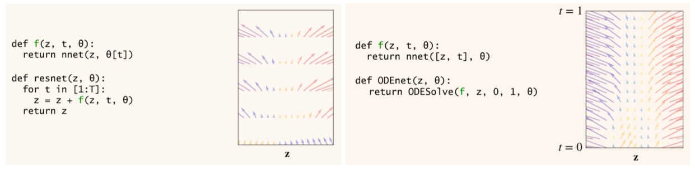
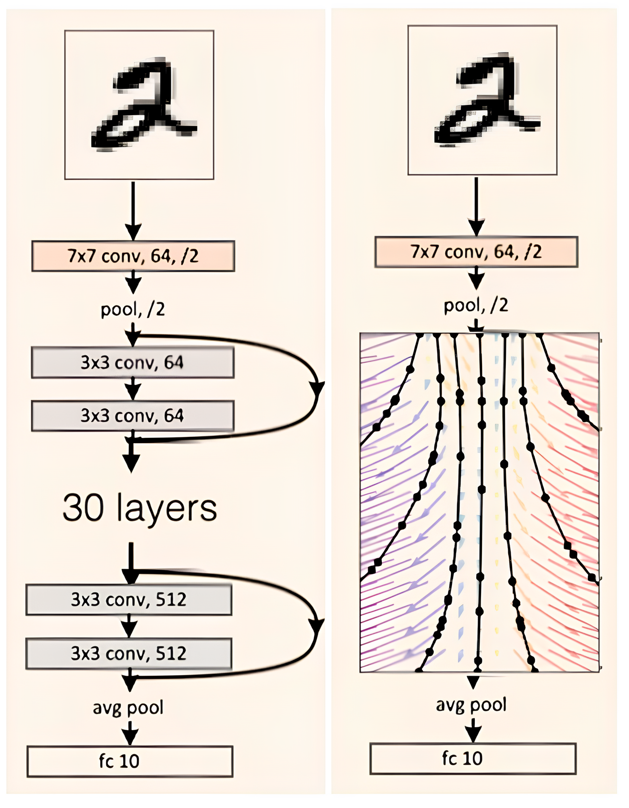

# flow matching timeline and key papers

## 2018 arXiv(NeurIPS 2018 Oral): “Neural Ordinary Differential Equations” (Chen et al.)
> [Paper](https://neurips.cc/virtual/2018/oral/12596) & [Video](https://www.youtube.com/watch?v=V6nGT0Gakyg)

Neural ODE 的核心思想：把“深度网络的层”看成是“时间上连续演化的状态”，从而用微分方程来建模，而不是离散的层堆叠。

注意到残差网络与欧拉积分器之间有着密切的联系，只需做一个简单的改动，就能使其动力学像 ODE 一样随深度连续变化，
- 残差网络需要定义 ResNet 模块，它定义了每一层隐藏单元的更新，然后构建 ResNet，只需在每一层计算更新，并将其加入当前的隐藏状态，这看起来就像欧拉积分。
- 可以简单地将当前深度输入到 ResNet 模块，并对整个深度使用固定的参数集，这意味着在层之间也定义了动力学，并且可以随深度连续变化。因此这个模型实际上定义了一个常微分方程，可以自由地用更复杂的自适应求解器来替代欧拉方法，并且该求解器可以在任意位置评估动力网络，希望以尽可能少的步骤得到最终答案，可以看到中心的简单动力学比两侧更复杂的动力学需要更少的评估次数。

现在有了新的微分模型组件，可以随意放入模型中，将一组 ResNet 层全部替换为单个 ODE 网络，此外，ODENet 的优势在于它们通常比 ResNet 需要更少的参数，网络动态随深度平滑变化，相邻层的参数会自动绑定在一起，不同“层”（即不同时间点）共享同一组参数。

## 2022 arXiv(NeurIPS 2024 Tutorial): “Flow Matching for Generative Modeling” (Lipman et al.)
> [Paper](https://arxiv.org/abs/2210.02747) & [Openreview](https://openreview.net/forum?id=PqvMRDCJT9t) & [Video](https://neurips.cc/virtual/2024/tutorial/99531)

提出了 Flow Matching（FM）范式：不再依赖扩散过程中的逐步去噪，而是回归固定概率路径的速度场，实现 CNF 的模拟自由训练。

## 2023 arXiv(): “Improving and generalizing flow-based generative models with minibatch optimal transport” (Tong et al.)
> [Paper](https://arxiv.org/abs/2302.00482) & [Openreview](https://openreview.net/forum?id=CD9Snc73AW) & [Video](https://www.youtube.com/watch?v=UhDtH7Ia9Ag) & [Code](https://github.com/atong01/conditional-flow-matching)
